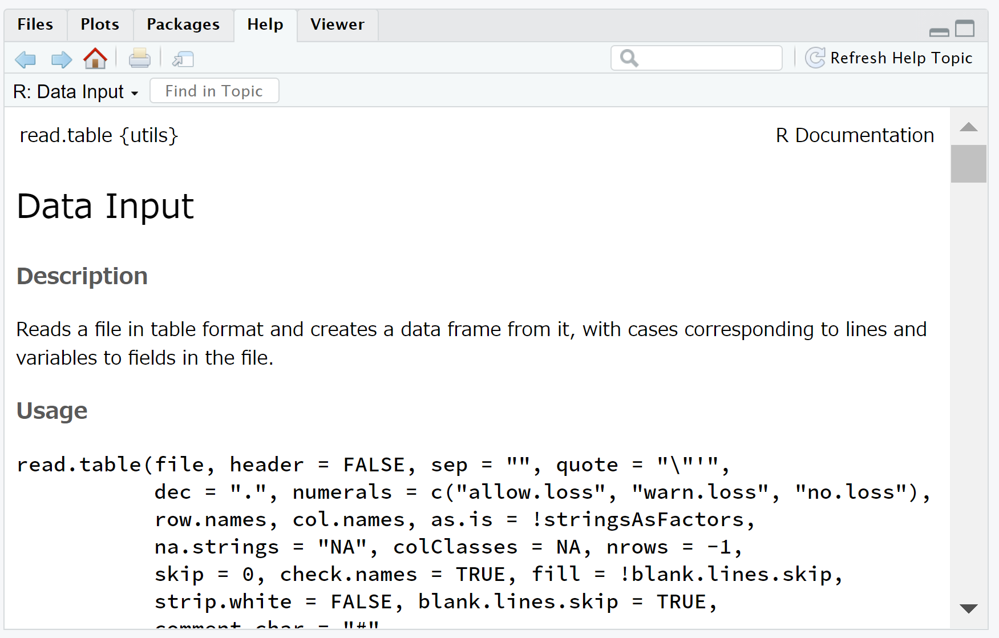
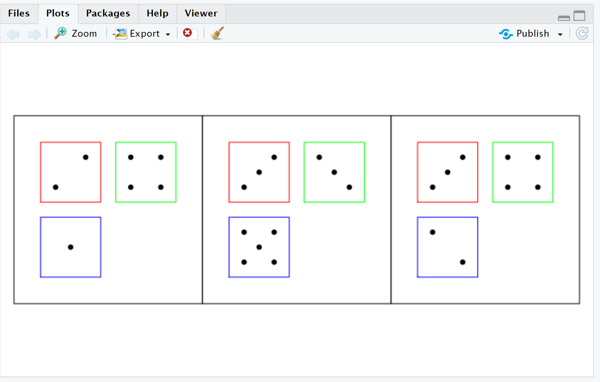
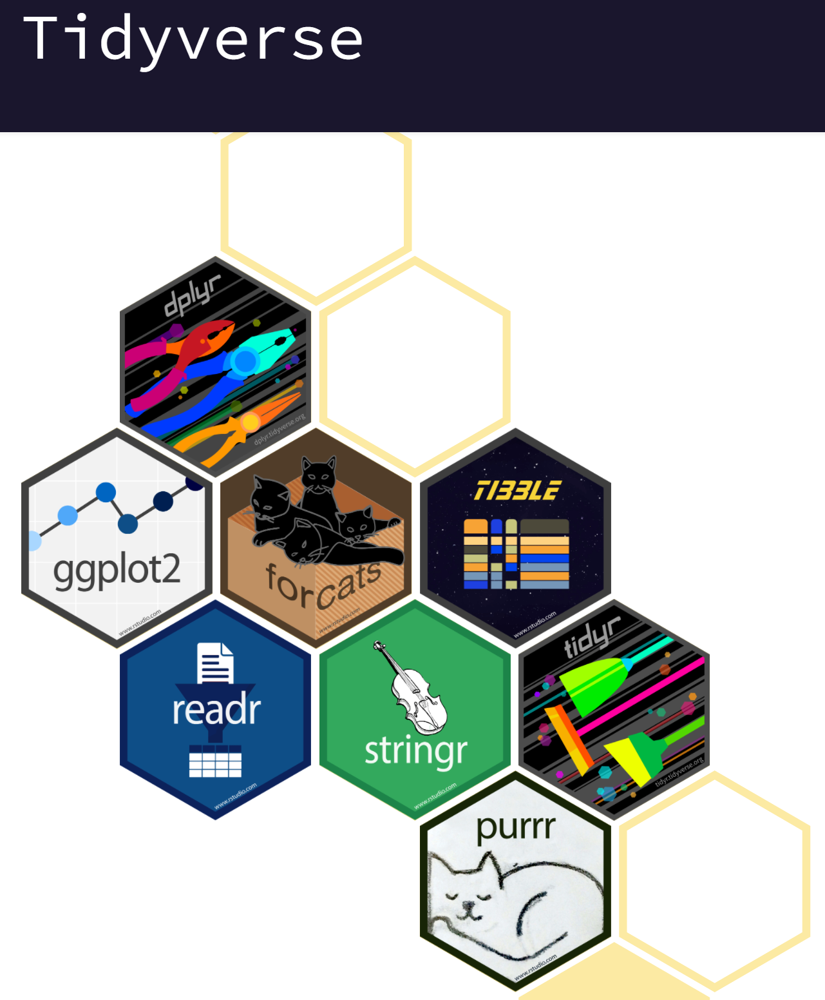
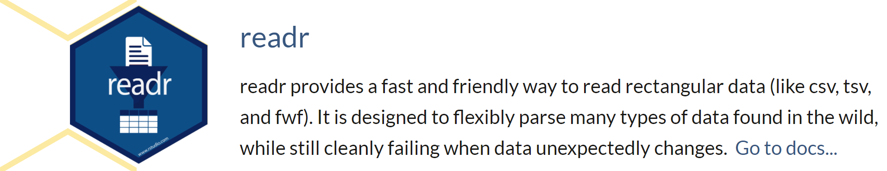
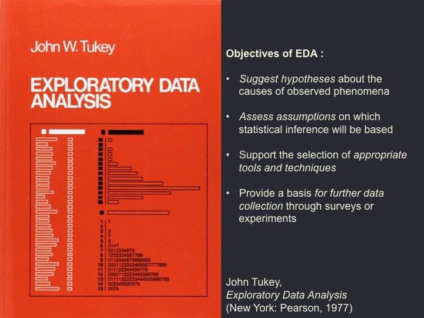
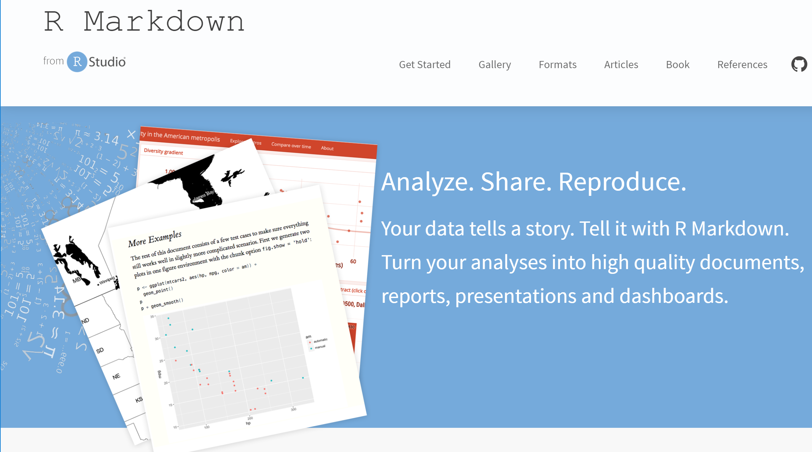

```{r setup, include = FALSE}
library(knitr)
```

# このコンテンツについて

## コンテンツの位置づけ

* "今日からはじめるR" は、Japan.R 2019の初心者セッションにおいて発表した内容を改訂したものです。
* **Rというモノにはじめて触れる (しかもコンピュータ全般にあまり詳しくない) 人が、データ分析のひととおりの流れを体験する**ことを目的に作成したコンテンツです。

## 想定する対象者

ここでいう「Rというモノにはじめて触れる (しかもコンピュータ全般にあまり詳しくない) 人」とは、

* ふだんはWindowsパソコンでWordとExcelを使っている、
* プログラミングは授業や研修で少し触れたことがあるくらい、
* データ分析をしたいと思っているが、知識も経験もない、
* 非理系のビジネスパーソン、学生

といったような方を想定しています。

## 動画作成者について

フリーランス　人材育成・研修サービス　田中 健太

* 経歴
    * 2010.03　東京工業大学大学院　博士課程単位取得退学
    * 2010.04　ベンダー系研修会社　入社 ITインフラや新人研修、データ分析領域の研修を担当
    * 2016.04　マーケティングリサーチ会社　入社 デジタルマーケティング部門のアナリストとしてデータ分析、サービス開発に従事
    * 2018.03　独立開業
    * 2020～　専修大学ネットワーク情報学部　非常勤講師

今のところ、研修講師を主な仕事にしています

::: notes

さて、内容に入る前に、少し自己紹介をさせてください。改めて、今回のシリーズを作成した田中健太と申します。フリーランスとして、教育、研修を主なビジネスとしています。
2020年から、大学の非常勤講師としても、データ分析関連の授業を行っています。
このシリーズでは、主に社会人向けの教育・研修を仕事としている者が、同じ立場の方向けに、何かしら参考になる情報を紹介できれば、と思っています。

:::

## コンテンツの構成

このコンテンツは以下のような内容を含みます。

* データ分析のプロセス
* Rの概要
* パッケージ
* データの収集 (読み込み)
* データの観察
* データの加工
* モデルの作成と評価
* 分析結果のレポート

それぞれについて、動画を分割し公開しています。

## ハンズオン環境について

このコンテンツで紹介する内容についてのハンズオンをRStudio Cloudのワークスペースとして公開しています。それぞれのワークスペースへの "入り口" を以下のURLにまとめています。

https://mana.bi/jr1921

ぜひ動画を見ながら、実際にRを操作してみてください。なお、利用にはRStudio Cloudのアカウントが必要です。

# 1. データ分析のプロセス

## 1.1　ビジネスにおけるデータサイエンスプロジェクトの流れ

* ビジネスにおいては、何らかの課題解決のために「プロジェクト」が結成され、予算やスケジュールなどの制約のもと活動する

## 1.2　データ分析のプロセス

* データ分析はあるステップが完了してから先に進む、というものではなく、試行錯誤を繰り返して、何度も手戻りしながら進めていく
* よく知られたフレームワークとしてKDDやSEMMAがある

# 2. Rの概要

## 2.1　Rとは

* Rは統計解析のためのプログラミング言語

## 2.2　CRAN

* CRAN (Comprehensive R Archive Network) https://cran.ism.ac.jp/ (国内ミラーサイト) は、Rに関する情報が集積する公式サイト
* R本体やパッケージ (後述) が公開されている

## 2.3　RStudioとは

* RStudioはRプログラミングのための統合開発環境

## 2.3.1　ハンズオンのためのRStudio Cloudワークスペース

https://mana.bi/jr1921

## 2.3.2　RStudio (Cloud) の基本操作

* RStudioは大きく4つのペインから構成される

## 2.3.3　エディタペイン

* エディタペインでRプログラムなどを記述する
* 記述したプログラムは `Ctrl + Enter` で実行できる

## 2.3.4　コンソールペイン

* コンソールペインではRが起動し入力を待ち受けている
* 直接プログラムを入力、実行もできる

## 2.3.5　オブジェクトペイン

* プログラムの中で作成したオブジェクト (変数) の情報を確認できる
* データフレームなどはクリックすると内容が表示される

## 2.3.6　その他ペイン

* ファイル一覧やグラフィックス表示、パッケージ管理などの機能が集約され、タブで切り替え可能

## 2.3.7　ハンズオン: ファイルを開いてプログラムを実行してみよう

* プログラムの意味は後述しますが、RStudio Cloudに接続してファイルを開き、プログラムを実行できることを確認しましょう

## 2.4　Rの基本ルール

:::::{.columns}

:::{.column width="48%"}

* Rはデータをオブジェクトに格納し、関数を適用して処理する
* オブジェクトは変数とも呼ばれ、矢印 (`<` と `-`) で代入する
* 作成したオブジェクトに関数を適用する
* `#` でコメントが書ける

:::

:::{.column width="48%"}

```{r eval=TRUE, message=FALSE, warning=FALSE}
a <- 1 # オブジェクトaに1を代入
a # aの中身を参照
```

```{r eval=TRUE, message=FALSE, warning=FALSE}
a <- 3 # オブジェクトaに3を代入
sqrt(a) # aの平方根を算出する
```

:::

:::::

::: notes

このあたりは、ちゃんとやるとそれだけで数時間になりますし、お金が取れますので、このコンテンツではごく「さわり」を流す感じとさせていただきます。

:::

## 2.5　Rのデータ構造

* データを格納するためのさまざまな構造が利用できる
* 基本的には関数を用いて作成する

## 2.5.1　ベクトル

* **ベクトル** は1行に複数の値が並んで格納される構造
* `c()` 関数で作成し、`オブジェクト名[要素番号]` で参照できる
* `:` を使った範囲指定もできる

## 

```{r eval=TRUE, message=FALSE, warning=FALSE}
a <- c(7, 8, 9, 0) # ベクトルを作成
a # ベクトル全体を参照
```

```{r eval=TRUE, message=FALSE, warning=FALSE}
a[2] # ベクトルの2番目の要素を参照
```

```{r eval=TRUE, message=FALSE, warning=FALSE}
a[2:4] # ベクトルの2番目から4番目の要素を参照
```

## 2.5.2　行列

* **行列** は行方向、列方向に値が並んで格納される構造
* `matrix()` 関数で作成し、`オブジェクト名[行番号, 列番号]` で参照できる
* 行または列の指定を省略すると、全行、全列を参照できる

## 

```{r eval=TRUE, message=FALSE, warning=FALSE}
a <- 1:9 # ベクトルを連番で作成
b <- matrix(a, nrow = 3) # 行列を作成
b
```

```{r eval=TRUE, message=FALSE, warning=FALSE}
b[1, ] # 行列の1行目を参照
```

```{r eval=TRUE, message=FALSE, warning=FALSE}
b[, 1] # 行列の1列目を参照
```

## 2.5.3　データフレーム

* ファイルから読み込んだ表構造データは、**データフレーム**として管理される
* CSV形式に対応する `read.csv()` 関数などを使用する
* 参照は `オブジェクト名[行番号, 列番号]` に加え、`オブジェクト名$列名` や `オブジェクト名[["列名"]]` などが使える

## 

```{r eval=TRUE, message=FALSE, warning=FALSE}
# "東京都_新型コロナウイルス感染症陽性者数（区市町村別）" オープンデータを読み込む
a <- read.csv("data/130001_tokyo_covid19_positive_cases_by_municipality.csv")
head(a) # データの先頭5行を出力
```

```{r eval=TRUE, message=FALSE, warning=FALSE}
a[20, ] # データフレームの20行目を出力
a[["陽性者数"]] # "陽性者数" 列を出力
```

## 2.6　さまざまな関数

* すでに使っているが `read.csv()` や `head()` は関数 (function) と呼ばれる
* 関数には**引数**や**オプション**を指定できる
* Rに標準で組み込まれている関数だけでも多様なデータ処理、分析ができる

## 

```{r eval=TRUE, message=FALSE, warning=FALSE}
date() # 引数のいらない関数を実行
```

```{r eval=TRUE, message=FALSE, warning=FALSE}
sqrt(9) # 引数が必要な関数を実行
```

```{r eval=TRUE, message=FALSE, warning=FALSE}
a <- 1:100
head(a, n = 10) # オプションを指定できる関数を実行
```

## 2.7　ヘルプの参照

:::::{.columns}

:::{.column width="48%"}



:::

:::{.column width="48%"}

* Rでは全ての関数にヘルプが用意されている
* `help(関数名)` で参照できる
* RStudioでは、その他ペインの [Help] タブに表示される

:::

:::::

# 3. パッケージ

## 3.1　パッケージとは

* Rは組み込み関数だけでなく、パッケージを使って機能拡張できる
* 世界中のユーザーがパッケージを無償で公開してくれている


## 3.2　パッケージの読み込み

* Rに標準添付されるパッケージもある
* パッケージは `library(パッケージ名)` 関数で読み込む
* パッケージを読み込むと、追加の関数などが使えるようになる

## 

```{r eval=TRUE, message=FALSE, warning=FALSE}
library(foreign) # foreignパッケージを読み込む
# SPSS形式のファイルを読み込む
# データ出典: https://study.sagepub.com/aldrich3e/student-resources/ibm%C2%AE-spss-%C2%AE-sample-files
df <- read.spss("data/advert.sav", to.data.frame = TRUE)
df
```

## 3.3　パッケージのインストール

* 多くのパッケージは審査を経てCRANで公開されている
* CRANからインストールするには、RStudioのメニューまたは `install.packages()` 関数を使う

##

```{r eval=FALSE, message=FALSE, warning=FALSE}
# 統計教育のためのサンプルパッケージをインストールする
install.packages("TeachingDemos")
```

```{r eval=FALSE, message=FALSE, warning=FALSE}
library(TeachingDemos)
dice(rolls = 3, ndice = 3, plot.it = TRUE)
```



## 3.4　パッケージを探すには

* 使いたい関数がどのパッケージに含まれるかは、現状調べるしかない
* CRANの検索機能や、METACRANなどのサイトを活用する

## 3.5　GitHubからのインストール

* 近年、パッケージをGitHubで公開する開発者も多い
* GitHub上のパッケージは、まず `remotes` パッケージをCRANからインストールし、`install_github("ユーザー名/リポジトリ名")` 関数を使う

```{r eval=FALSE, message=FALSE, warning=FALSE}
install.packages("remotes") # パッケージのインストール
```

```{r eval=FALSE, message=FALSE, warning=FALSE}
library(remotes) # パッケージの読み込み
# 動画作成者による「何もしない」パッケージをインストール
install_github("ltl-manabi/nothing")
```

```{r eval=TRUE, message=FALSE, warning=FALSE}
library(nothing) # パッケージの読み込み
hello() # ただ、「Hello, World!」と出力するだけの関数を実行
```

## 3.6　tidyverseパッケージ群について

:::::{.columns}

:::{.column width="48%"}



:::

:::{.column width="48%"}

* 近年、広く使われる、データの読み込みから加工、可視化、モデリング、ワークフロー管理までトータルにカバーするパッケージ群
* **tidy data** の考え方に基づき、統一された書式で効率的なRプログラミングができる
* パイプ ( `%>%` ) で処理をつないでいくことで、高度な処理を簡潔に記述できる

:::

:::::

## 

```{r eval=FALSE, message=FALSE, warning=FALSE}
install.packages("tidyverse")
```

```{r eval=TRUE, message=FALSE, warning=FALSE}
library(tidyverse) # パッケージの読み込み
# tidyverseに含まれるパッケージの一覧を出力
tidyverse_packages()
```

# 4. データの収集

## 4.1　Rのデータ型

* データは、定義や測定の方法によって4つの尺度に整理される
* 尺度ごとに、適用できる処理、分析手法が異なる
* Rでは、データの尺度に対応して、データ型が存在する

## 4.2　テキストデータの読み込みにはreadrパッケージ

* readrパッケージは、tidyverseの一部
* 組み込み関数でもテキストファイルを読み込めるが、より便利な機能を提供している



## 4.3　read_csv() 関数によるデータの読み込み

* CSVファイルを読み込むための関数
* 標準の文字コードはUTF-8
* `data.frame` ではなく、`tibble` (`tbl_df`) という型になる

## 

```{r eval=TRUE, message=FALSE, warning=FALSE}
library(readr)
# library(tidyverse) # tidyverseをまるごと読み込んでもよい

df <- read_csv("data/130001_tokyo_covid19_positive_cases_by_municipality.csv")
df # 自動的に表示が省略される
```

## 4.4　readxlパッケージによるExcelファイルの読み込み

* Excel形式のファイルを読み込むためのパッケージ
* `read_excel()` 関数でシートやセルを指定して読み込むことができる

## 

```{r eval=TRUE, message=FALSE, warning=FALSE}
library(readxl)
# library(tidyverse) # tidyverseをまるごと読み込んでもよい

# 文部科学省 子供の学び応援サイト掲載コンテンツ情報（オープンデータ）を読み込み
df <- read_excel("data/20201221-mxt_syogai03-000010378_1.xlsx")
df
```

## 4.5　RDBMSとの接続

* RDBMSとも接続し、SQLを実行した結果をデータフレーム (`tbl_df`) として取得できる
* さまざまなRDBMSへの共通したインターフェースとしてDBIパッケージがある
* 実際のコネクターはDBごとにパッケージを使い分ける

## 

```{r eval=FALSE, message=FALSE, warning=FALSE}
# パッケージのインストール
install.packages("DBI")
install.packages("RSQLite")
```

```{r eval=TRUE, message=FALSE, warning=FALSE}
# パッケージの読み込み
library(tidyverse)
library(DBI)
library(RSQLite)

# SQLiteデータベースに接続
db <- dbConnect(SQLite(), "data/stationery.db")
# SQLクエリを発行し、結果を取得する
df <- dbSendQuery(db, "SELECT * FROM 商品マスター") %>% dbFetch()
# 結果の確認
df
# DBとの接続を切断する
dbDisconnect(db)
```

# 5. データの観察

## 5.1　探索的データ解析 (EDA)

:::::{.columns}

:::{.column width="48%"}



:::

:::{.column width="48%"}

* Tukeyが1960年代に提唱した分析の考え方
* いきなり難しい分析手法を適用するのではなく、まずはデータの観察から始めましょうという考え方

:::

:::::

## 5.2　Rによる探索的データ解析

* 探索的データ解析はDataExplorerパッケージ、ExPanDパッケージ、skimrパッケージなどで行う

## 5.3　DataExplorerパッケージによるEDA

* DataExplorerパッケージは、データフレームの基本的な情報をレポートとして出力する
* レポートは標準ではHTMLで出力され、基本統計量や分布形状を確認できる

## 

```{r eval=FALSE, message=FALSE, warning=FALSE}
install.packages(DataExplorer)
```

```{r eval=TRUE, message=FALSE, warning=FALSE}
library(tidyverse)
library(DataExplorer)

df <- read_csv("data/130001_tokyo_covid19_positive_cases_by_municipality.csv")
create_report(df, output_dir = "report")
```

## 5.4　ExPanDパッケージによるEDA

* ブラウザ (HTML) ベースのGUIでEDAが実行できる
* `export_nb_option` を `TRUE` にするとファイルとして出力できる

## 

```{r eval=FALSE, message=FALSE, warning=FALSE}
install.packages(ExPanDaR)
```

```{r eval=FALSE, message=FALSE, warning=FALSE}
# パッケージの読み込み
library(tidyverse)
library(ExPanDaR)

# データの読み込み
df <- read_csv("data/130001_tokyo_covid19_positive_cases_by_municipality.csv")

# レポートの起動
ExPanD(df, export_nb_option = TRUE)
```

## 5.5　skimrパッケージによる基本統計量の算出

* skimrパッケージは基本統計量を算出するためのパッケージ
* tidyverseに最適化された出力が得られる

## 

```{r eval=FALSE, message=FALSE, warning=FALSE}
install.packages("skimr")
```

```{r eval=TRUE, message=FALSE, warning=FALSE}
library(tidyverse)
library(skimr)

df <- read_csv("data/130001_tokyo_covid19_positive_cases_by_municipality.csv")

# 基本統計量の算出
skim(df)
```

## 5.6　ggplot2パッケージによる可視化

* ggplot2は、tidyverseに基づく多彩なグラフィックスを作成するためのパッケージ
* あまりにも高機能なので、今回は「そういうのがある」としか扱わない

## 

```{r eval=TRUE, message=FALSE, warning=FALSE}
library(tidyverse)

df <- read_csv("data/130001_tokyo_covid19_positive_cases_by_municipality.csv")

# 陽性者数の累積を棒グラフでプロット
ggplot(df, aes(x = 公表_年月日, y = 陽性者数)) + geom_bar(stat = "identity") + scale_x_date(breaks = "3 month") + ggtitle("東京都の陽性者数 (累積)")
```

```{r eval=TRUE, message=FALSE, warning=FALSE, fig.width=12, fig.height=6}
# 区の順番を全国地方公共団体コードに合わせる
df[["市区町村名"]] <- factor(df[["市区町村名"]])

df <- df %>% mutate(市区町村名 = fct_reorder(市区町村名, 全国地方公共団体コード))

# データから23区のみを抽出、前日の値を引いて各日の陽性者数を求める
filtered_df <- df %>% filter(str_detect(市区町村名, "区$")) %>% mutate(市区町村名 = fct_drop(市区町村名)) %>% group_by(市区町村名) %>% mutate(当日陽性者数 = lead(陽性者数) - 陽性者数)

# 陽性者数の推移を区ごとに棒グラフでプロット
ggplot(filtered_df, aes(x = 公表_年月日, y = 当日陽性者数, group = 市区町村名)) + geom_bar(stat = "identity") + scale_x_date(breaks = "3 month", date_labels = "%m") + lims(y = c(0, 200)) + facet_wrap(~ 市区町村名, ncol = 8) + ggtitle("東京都23区ごとの陽性者数の推移") + theme_minimal()
```

# 6. データの加工 (前処理)

## 6.1　前処理の目的

* 前処理は「よりよい」分析のため

## 6.2　dplyrパッケージによるデータの抽出、加工

:::::{.columns}

:::{.column width="48%"}


:::

:::{.column width="48%"}

* dplyrは、データ加工のための一貫した処理体系を提供するパッケージ
* 主要な関数は以下の通り
    * `select()`: 列名でデータを選択する
    * `filter()`: 条件に合致するデータを抽出する
    * `mutate()`: データフレームに新しい列を追加する
    * `summarise()`: 複数行・列のデータを集約する
    * `arrange()`: 行を並べ替える
    * `group_by()`: データをグループ化する

:::

:::::

## 6.2.1　select() 関数による列の選択

* `select(列名)` とすることでデータフレームから任意の列を選択できる
* `select(列名1, 列名2, ...)` や `select(開始列名:終了列名)` など多様な指定ができる

## 

```{r eval=TRUE, message=FALSE, warning=FALSE}
library(tidyverse)

df <- read_csv("data/130001_tokyo_covid19_positive_cases_by_municipality.csv")

# 列名を列挙して選択
selected_df <- select(df, 公表_年月日, 市区町村名, 陽性者数)
head(selected_df)
```

```{r eval=TRUE, message=FALSE, warning=FALSE}
# パイプを使った選択
df %>% select(公表_年月日, 市区町村名, 陽性者数) %>% head()
```

## 6.2.2　filter() 関数による行の抽出

* `filter(条件式)` とすることで条件に合致する行を抽出できる
* 数値の大小、文字を含む含まないなど、柔軟に条件を指定できる

## 

```{r eval=TRUE, message=FALSE, warning=FALSE}
# 2021年4月1日以降のレコードだけ抽出
df %>% filter(公表_年月日 >= "2021-04-01") %>% head()
```

```{r eval=TRUE, message=FALSE, warning=FALSE}
# 港区のレコードだけ抽出
df %>% filter(市区町村名 == "港区") %>% head()
```

```{r eval=TRUE, message=FALSE, warning=FALSE}
# 「〇〇村」のレコードだけ抽出
# 正規表現で "村$" としないと、東村山市なども抽出される
df %>% filter(str_detect(市区町村名, "村$")) %>% head()
```

## 6.2.3　mutate() 関数による列の追加

* `mutate(列名 = 処理)` とすることで、新しい列を追加できる
* `group_by()` 関数と組み合わせることで条件別の処理もできる
* 既存の列を上書きすることもできる

## 

```{r eval=TRUE, message=FALSE, warning=FALSE}
# データが累積なので、前日の値を引いて陽性者数の前日比を算出する
mutated_df <- df %>% group_by(市区町村名) %>% mutate(陽性者数前日比 = 陽性者数 - lag(陽性者数))
tail(mutated_df, 100)
```

## 6.2.4　summarise() 関数による要約

* `summarise(列名 = 集計処理)` とすることで、要約値を得ることができる
* `group_by()` 関数と組み合わせることで条件別の要約もできる

## 

```{r eval=TRUE, message=FALSE, warning=FALSE}
# 区ごと、月別に、毎日何人の陽性者が発表されるかの平均を算出
summarised_df <- mutated_df %>%
                    filter(str_detect(市区町村名, "区$")) %>%
                    mutate(公表_年月 = format(公表_年月日, "%y-%m")) %>%
                    group_by(市区町村名, 公表_年月) %>%
                    summarise(月別平均陽性者数前日比 = mean(陽性者数前日比, na.rm = TRUE))
# 港区のレコードを抽出
filter(summarised_df, 市区町村名 == "港区")
```

## 6.3　recipesパッケージによるデータの加工

* recipesは、データ分析の "レシピ" を共通化し、データ分析における様々な前処理、アルゴリズム、パッケージを統一的に扱うためのパッケージ
* 前処理のためのさまざまな関数が提供されており、`step_*()` として使用できる
* tidymodelsパッケージ群の一部で、ここではさわりだけ

## 

```{r eval=FALSE, message=FALSE, warning=FALSE}
install.packages("tidymodels")
```

```{r eval=TRUE, message=FALSE, warning=FALSE}
library(tidymodels)

# 標準添付のairqualityデータセットを使用する
# Month列をfactor型に変換し、Day列を取り除く
aq_df <- airquality %>% select(-Day) %>% mutate(Month = as.factor(Month))

# データを学習用と検証用に分割する
# データの分割割合を指定
split_ratio <- initial_split(aq_df, prop = 0.8)

# 学習用データをサンプリング
df_train <- training(split_ratio)

# 検証用データをサンプリング
df_test <- testing(split_ratio)

# データに対して、数値の標準化と欠損値の除去を行うレシピを定義
rec <- df_train %>%
  recipe(Ozone ~ .) %>%
  step_naomit(all_predictors(), all_outcomes()) %>%
  step_normalize(all_predictors(), -Month)

# レシピを実行
res_df_train <- rec %>% prep() %>% juice()
res_df_test <- rec %>% prep() %>% bake(new_data = df_test)

head(res_df_train)
head(res_df_test)
```

# 7. モデルの作成と評価

# 8. 分析結果のレポート

## 8.1　レポート作成はRMarkdownで

:::::{.columns}

:::{.column width="48%"}



:::

:::{.column width="48%"}

* Rで分析した結果は、誰かに報告することがほとんど
* グラフィックスやデータをWordやPowerPointに貼り付けることもできるが、**RMarkdown** で直接レポートを生成すると便利
* RMarkdownはIT業界で広く使われる**Markdown**を使い、文章とプログラムを混在させてドキュメントを作成できる仕組み

:::

:::::

## 8.2 Markdownとチャンク

* Markdownは `#` などを使ったシンプルなフォーマットで記述できる
* Rプログラムは**チャンク**という要素の中に記述する

## 

```{r eval=TRUE, message=FALSE, warning=FALSE}
a <- 1 # オブジェクトaに1を代入
a # aの中身を参照

a <- 3 # オブジェクトaに3を代入
sqrt(a) # aの平方根を算出する
```

## 8.3　RMarkdownによるレポート出力

* RMarkdownで記述したソースは多種多様なフォーマットで出力できる

```
---
title: "今日からはじめる"
subtitle: "～キホンから分析、グラフ作成まで～"
date: "2021-04-15"
author:
- "タナカケンタ"
- "https://mana.bi/"
output:
    bookdown::powerpoint_presentation2:
        reference_doc: "./Rmd_Blackboard_template.pptx"
        master: "Rmd"
        slide_level: 2
        number_sections: false
    html_document:
        toc: true
    pdf_document:
        latex_engine: xelatex
---
```