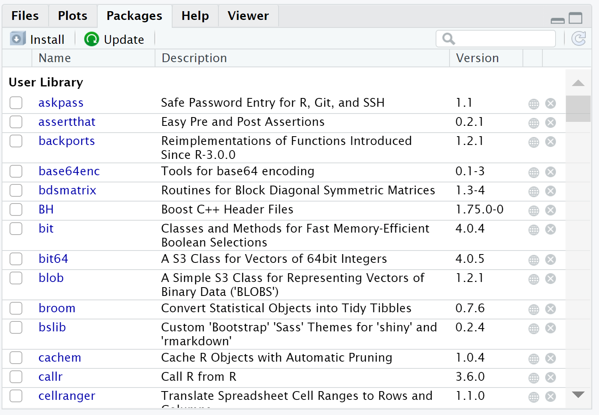
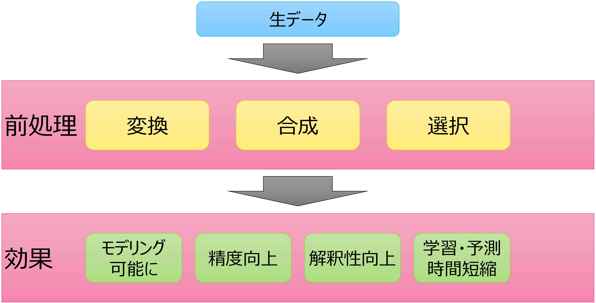

```{r setup, include = FALSE}
library(knitr)
```

# このシリーズについて

::: notes

こんにちは。動画を作成した田中と申します。今回は、「今日からはじめるR」をご覧いただき、ありがとうございます。はじめに、この一連のシリーズについて、位置づけなどを紹介します。

:::

## コンテンツの位置づけ

* "今日からはじめるR" は、Japan.R 2019の初心者セッションにおいて発表した内容を改訂したものです。
* **Rというモノにはじめて触れる (しかもコンピュータ全般にあまり詳しくない) 人が、データ分析のひととおりの流れを体験する**ことを目的に作成したコンテンツです。

::: notes

この「今日からはじめるR」シリーズは、R言語のユーザーが集まるイベント、「Japan.R」において、2019年に初心者セッションとして発表した内容を改訂したものです。Rというものにはじめて触れる、という方向けに、Rとは何で、どうやって使うのか、何ができるのか、といったことを紹介しています。
Japan.Rにおいては、20分という極めて限られた時間でまくし立てましたが、改めて、何かをはじめて学ぶ人のペースに寄り添った形で、ちゃんとしたコンテンツに仕立て直したい、ということで改訂を行いました。

:::

## 想定する対象者

ここでいう「Rというモノにはじめて触れる (しかもコンピュータ全般にあまり詳しくない) 人」とは、

* ふだんはWindowsパソコンでWordとExcelを使っている、
* プログラミングは授業や研修で少し触れたことがあるくらい、
* データ分析をしたいと思っているが、知識も経験もない、
* 非理系のビジネスパーソン、学生

といったような方を想定しています。

::: notes

さて、ここで言う「Rにはじめて触れる人」とは、具体的にはこのような方をイメージしています。すでにエンジニアやデータ分析者として経験がある方、ではなく、そもそもデータ分析というものをこれまでやったことがない、プログラミングもほとんど経験がない、という方です。
すでに経験がある方は、その経験とRの特徴を照らし合わせて、「あぁ、Rではこうするのか」と確認するだけですから、もっとコンパクトな、あるいはもっと高度なコンテンツのほうが適していると思いますが、このコンテンツでは、そうではない、Rを、そしてデータ分析やプログラミングを、これからまさに始めようという方を対象に、基本的なところを紹介しています。
ですから、詳しい方にとってはくどい、長い、細かいところまで触れていない、と感じるでしょうけども、それはそういうターゲットに向けた構成だからです。ご了承ください。

:::

## 動画作成者について

フリーランス　人材育成・研修サービス　田中 健太

* 経歴
    * 2010.03　東京工業大学大学院　博士課程単位取得退学
    * 2010.04　ベンダー系研修会社　入社 ITインフラや新人研修、データ分析領域の研修を担当
    * 2016.04　マーケティングリサーチ会社　入社 デジタルマーケティング部門のアナリストとしてデータ分析、サービス開発に従事
    * 2018.03　独立開業
    * 2020～　専修大学ネットワーク情報学部　非常勤講師

今のところ、研修講師を主な仕事にしています

::: notes

さて、内容に入る前に、少し自己紹介をさせてください。改めて、今回のシリーズを作成した田中健太と申します。フリーランスとして、教育、研修を主なビジネスとしています。
2020年から、大学の非常勤講師としても、データ分析関連の授業を行っています。
このシリーズでは、主に社会人向けの教育・研修を仕事としている者が、同じ立場の方向けに、何かしら参考になる情報を紹介できれば、と思っています。

:::

## コンテンツの構成

このコンテンツは以下のような内容を含みます。

* データ分析のプロセス
* Rの概要
* パッケージ
* データの収集 (読み込み)
* データの観察
* データの加工
* モデルの作成と評価
* 分析結果のレポート

それぞれについて、動画を分割し公開しています。

::: notes

この「今日からはじめるR」シリーズでは、大きくは画面に示すトピックを扱っています。Rでデータ分析を行う上で知っておきたい、基本的な事柄をトータルに取り上げています。なお、順次作成していますので、この動画をご覧になっている時点で、まだ公開されていないトピックもあるかもしれません。
また、それぞれのトピックについて、きちんと実務でプロフェッショナルとして活躍できるレベルまで学ぼうとすると、1つ1つについて何十時間、あるいはそれ以上の長い時間が必要となります。それこそ、大学のデータサイエンス学部などで、4年かけて学ぶわけです。
今回は、「はじめてRを学ぶ」という方が対象ですし、最初からそんなに何十時間もしっかりと勉強しようという覚悟があることも少ないでしょうから、それぞれのトピックについて30分程度の動画にまとめています。その内容を踏まえて、さらにご自身で学習を進めていただくと良いでしょう。もちろん、「もう少し詳しく学びたい、学ばせたいから社内研修を開催したい」といったご依頼もお待ちしています。
一連の動画は、再生リストとしてまとめていますので、順番に視聴できます。詳しくは、この動画の説明文をご覧ください。

:::

## ハンズオン環境について

このコンテンツで紹介する内容についてのハンズオンをRStudio Cloudのワークスペースとして公開しています。それぞれのワークスペースへの "入り口" を以下のURLにまとめています。

https://mana.bi/jr1921

ぜひ動画を見ながら、実際にRを操作してみてください。なお、利用にはRStudio Cloudのアカウントが必要です。

::: notes

さて、このシリーズでは、ただ動画を眺めるだけでなく、そこで取り上げた内容について、実際にRを操作して体験できる、ハンズオン環境を用意しています。正確には、環境はクラウドサービスを利用していて、そこで実行するファイルを用意した、というものですが。今回は、Rをクラウドで利用できるRStudio Cloudというサービスで、ハンズオンができるようにしています。画面に示すURL、これは動画の説明文でもリンクしていますが、こちらでアクセスの方法などを紹介していますので、ご確認ください。
動画を見るだけでは、特にプログラミングのスキルは身につかないでしょうし、実際に操作してみて、できそうだ、もっと勉強しよう、と思うか、あ、やっぱ無理だと感じるか、ぜひご自身で確認してみてください。

:::

# 1. データ分析のプロセス

::: notes

それでは、内容に入っていきましょう。この動画では、Rの操作に入る前に、まず「データ分析のプロセス」として、そもそもデータ分析にはどのような作業があるのか、ということを紹介します。

:::

## 1.1　ビジネスにおけるデータサイエンスプロジェクトの流れ

* ビジネスにおいては、何らかの課題解決のために「プロジェクト」が結成され、予算やスケジュールなどの制約のもと活動する


::: notes

はじめに、ビジネスにおけるデータサイエンスプロジェクトの流れを確認しましょう。この動画シリーズでは、ビジネスパーソンを主な対象と想定していますが、大学の研究であっても、基本的な部分は変わりません。
ここでは、IPA、情報処理推進機構が公表している、IT技術者のスキル標準のひとつである「ITSS+」で定義されている、データサイエンスプロジェクトの全体像を示しています。インターネットで「ITSS+」と検索すれば、他にもスキルチェックリストや詳しい解説なども出てきますので、ぜひご覧ください。さて、ビジネスにおいて、データを用いて何か価値を生み出すことをここではデータサイエンス、と考えますが、データサイエンスは多くの場合ひとりではなく、何人かのプロジェクトとして取り組みます。そして、思い付きで進めるのではなく、プロセスに沿って進めます。ITSS+では、プロセスを大きく4つに分けています。
はじめに、そもそもデータを使って何を実現したいのか、企画するフェーズです。ここが曖昧だと、価値のある結果は得られません。次に、企画段階で決めた目的に沿って、必要なデータを集めます。もし、まだ手元にデータがなければ、集めるところから始まりますので、プロジェクトの完了はその分だけずれ込みます。
そして、集めたデータを分析し、何らかの知見を得ます。ここが、今回主に扱う、Rなどを使って「データ分析する」という部分です。1回で終わるものではなく、トライアンドエラーで、何度もいろんなアプローチで取り組みます。そして、そこで得られた知見を、現場にどう組み込んでいくかを検討し、実行します。ここも、いい数字が得られたから明日から全てのプロセスを変える、とはいきませんので、現場に説明し、納得してもらい、時間をかけて導入する、というコミュニケーションが必要になります。
ビジネスにおけるデータサイエンスの全体像は、このようなものになります。

:::

## 1.2　データ分析のプロセス

* データ分析はあるステップが完了してから先に進む、というものではなく、試行錯誤を繰り返して、何度も手戻りしながら進めていく
* よく知られたフレームワークとしてKDDやSEMMAがある


::: notes

さて、データ分析の作業について、もう少し細かく整理した、いくつかのフレームワークがあります。これらは、新しいものではなく、ビジネスの世界でコンピューターにデータが蓄積され始めた、1980年代末期から検討され、使われています。
データベースから知見を得るプロセスを整理したものが、KDD, Knowledge discovery in databasesです。データを選択、抽出し、加工し、分析して結果を評価する、という流れがまとめられています。また、同じようにデータ分析のプロセスとして考案されたものが、SEMMA, Sample, Explore, Modify, Model, Assessです。データを抽出し、観察し、加工してモデルを作成し、評価するというプロセスを整理しています。ここでいうモデル、とはデータの特徴やデータどうしの関係を理解し、記述したものと言えます。モデルが作成できれば、そのモデルをもとに予測などができます。
今回は、それ以上に踏み込んだ話はしませんが、このようなフレームワークを活用することで、自己流ではない、スムーズなデータ分析が可能になるでしょう。これらのフレームワークに基づいたRプログラミングの方法を紹介する書籍もありますので、参考にしてください。

:::

# 2. Rの概要

::: notes

この動画では、シリーズの2つ目のトピックとして、Rの概要を紹介します。まさにシリーズのメインといいますか、そもそもRとは何で、どういう風に使うのか、ということを紹介します。第1回で触れたように、実際に操作できるハンズオン環境を用意していますので、ぜひ動画を見るだけでなく、自分のペースで、Rを体験してみてください。

:::

## 2.1　Rとは

* Rは統計解析のためのプログラミング言語


::: notes

さて、そもそもRとは何でしょうか。もちろん、この動画を視聴している段階で、ある程度の下調べはついていると思いますが、改めて整理すると、「Rは統計解析のためのプログラミング言語」です。世の中にはいろんなプログラミング言語がありますが、その中で、統計解析、データ分析を主な用途とした言語です。
1993年ころからオープンソースソフトウェアとして開発されており、世界中の大学や企業で使われています。実際に、IEEEが毎年行っている、プログラミング言語の人気ランキング、といった調査では、データ分析専門であるにも関わらず、他の汎用言語に並ぶ根強い人気があります。
また、実行結果の正確性もきちんと検証されており、日本の総務省統計局や、アメリカFDA、食品医薬品局など世界中の政府機関がRを採用しています。少なくとも現在、「Rで分析しました」と言ってRそのものに不信を持たれることはないでしょう。

:::

## 2.2　CRAN

* CRAN (Comprehensive R Archive Network) https://cran.ism.ac.jp/ (国内ミラーサイト) は、Rに関する情報が集積する公式サイト
* R本体やパッケージ (後述) が公開されている


::: notes

そのようなRですが、どこから入手すれば良いのでしょうか。Rは、CRANというサイトで公開されています。CRANは、Rの開発プロジェクトの公式サイトで、Rそのものや、次のトピック、これは別の動画になりますが、そちらで紹介しているパッケージなどが公開されています。サイトは英語ですが、"Download R" など書いていますので、リンクを辿って、Rのインストーラーをダウンロードできます。macOSやLinuxなどでは、OSのパッケージ管理システム、Homebrewやaptなどを使ったほうが便利かもしれません。
CRANに限らず、Rのことを調べようとすると、英語を読まざるを得ません。もちろん、日本のRユーザーが有用な情報を発信してくれていますが、自分のプログラムのこのエラーについて知りたい、といった目的で検索すると、たいていは公式ドキュメントや、Stack Overflowなど海外の掲示板でのやり取りが出てきますので、英語は、読めるに越したことはないでしょう。

:::

## 2.3　RStudioとは

* RStudioはRプログラミングのための統合開発環境


::: notes

さて、Rをコンピューターにインストールすると、それだけでもRを使ったデータ分析ができます。ただ、Rだけでは、インターフェースがシンプルすぎて、使いづらいという声も多くあります。世の中のさまざまなテキストエディタが、Rプログラムを作成するためのモードをサポートしていますので、慣れてくれば、好きなものを使えばよいでしょう。
ここでは、Rの世界で、初心者からベテランまで、幅広く使われている統合開発環境である、RStudioを紹介します。Rストゥーディオという方もいます。その辺はお好みで。RStudioは、Rとは別に、RStudio社、という会社が開発しているソフトウェアで、商品として販売もされていますが、オープンソースソフトウェアでもあり、無償で利用できます。商品版は、大規模なプロジェクトで、複数人でRプログラムを共同開発するような場合に便利な機能が追加されていますが、個人で使う分には、無償版で何も困ることはありません。
RStudioは、RStudio社のWebサイトからダウンロードできます。RとRStudioは、それぞれ別々にコンピューターにインストールする必要があります。
また、2020年の8月からは、クラウドでRStudioを提供する、RStudio Cloudというサービスも正式に始まりました。ある程度までは無料で使えますので、今回のコンテンツでのハンズオンでも、RStudio Cloudを使う前提で説明しています。RStudio Cloudについては、別途「RStudio Cloudをはじめよう」という動画シリーズを公開していますので、そちらもご覧ください。たぶん、右上のあたりにリンクが出ていると思います。

:::

## 2.3.1　ハンズオンのためのRStudio Cloudワークスペース

https://mana.bi/jr1921


::: notes

それでは、RStudio Cloudを使ったハンズオン環境について紹介します。RStudio Cloudでは、自分が作った作業環境を、他のユーザーに共有できます。共有の仕方にも何通りかあって、自分の管理下で共同作業させるやり方もありますが、今回は、ワークスペースへのリンクを紹介し、みなさんのお手元にワークスペースをコピーして使っていただきます。
第1回の動画でも紹介しましたが、私のWebサイトに接続の手順などはまとめていますので、画面に示すURL、これは動画の説明文にも書いていますが、こちらにアクセスしてください。そこに、RStudio Cloudのワークスペースへのリンクが示されています。
リンクをクリックすると、RStudio Cloudへのログイン画面が表示されます。すでにアカウントがある方はそのままログインすれば良いですが、はじめて使う方は、登録が必要です。Googleアカウントなどを使って登録できますので、それほど複雑な手順ではありません。登録すればすぐに使えます。
ログインすると、私が作成した環境が、みなさん1人1人にコピーされ、RStudioが表示されます。ハンズオンのために必要なファイルと、パッケージ類がインストールされていますので、ファイルを開いてすぐに操作することができます。具体的な操作は、この後動画の中で説明していきます。

:::

## 2.3.2　RStudio (Cloud) の基本操作

* RStudioは大きく4つのペインから構成される


::: notes

RStudio Cloudにログインし、ワークスペースがコピーされると、RStudioの画面が表示されます。コンピューターにインストールするデスクトップ版と、基本的な見た目は変わりません。
RStudioの画面は、大きく4つの領域、ペインに分かれます。このうち、左上のエディタペインについては、まだファイルを開いていないので、表示されていません。基本的には、エディタペインでプログラムを書いて、コンソールペインで実行結果を確認します。プログラムの中で作成したオブジェクト、変数の情報をオブジェクトペインで見ることができます。また、すでに作成したファイルやデータの一覧、プログラムの中で作成したグラフィックスなどは右下のペインで表示されます。
このあと、それぞれのペインについてもう少し紹介しています。

:::

## 2.3.3　エディタペイン

* エディタペインでRプログラムなどを記述する
* 記述したプログラムは `Ctrl + Enter` で実行できる


::: notes

まず、エディタペインです。このあと、「では実際にやってみましょう」というページで改めてご案内しますが、ファイルを開くと、エディタペインが表示されます。エディタペインでは、主にRプログラムを作成します。実際には、RStudioはRだけでなく、PythonやSQLなど他の言語のプログラムにも対応していますので、プログラミング全般をRStudioで行うことができます。
そして、Rプログラムについては、実行したい部分にカーソルを移動させ、Ctrl + Enterキーを押すと、プログラムが実行され、コンソールペインなどに結果が表示されます。マウスで右上の "Run" ボタンを押しても同じ結果が得られますが、慣れてくるとキーボードから手を離したくなくなりますので、ショートカットキーを使ったほうが便利でしょう。なお、"Run" ボタンの隣の "Source" ボタンは、ファイルを上から下までまとめて実行します。この場合は、画面に出力する、と明示的に記述した結果だけが出力されます。

:::

## 2.3.4　コンソールペイン

* コンソールペインではRが起動し入力を待ち受けている
* 直接プログラムを入力、実行もできる


::: notes

次に、コンソールペインです。いわゆる、Rそのものがここで入力を待ち受けています。コンソールに直接プログラムを書いてEnterキーを押すことで実行できます。実際には、先ほど述べたようにエディタペインでCtrl + Enterキーを押して、プログラムを実行することが多いでしょう。

:::

## 2.3.5　オブジェクトペイン

* プログラムの中で作成したオブジェクト (変数) の情報を確認できる
* データフレームなどはクリックすると内容が表示される


::: notes

それから、オブジェクトペインです。ここでは、Rプログラムを実行する中で作成される、オブジェクトと言うものの名前、種類、サイズなどが表示されます。オブジェクトは、変数とも呼ばれます。もちろん、「オブジェクトの情報を得るプログラム」を書いて、コンソールで確認することもできますが、せっかくの統合開発環境なので、活用しましょう。
また、この動画の後半で紹介する、データフレームというデータ構造については、オブジェクトペインでオブジェクト名をクリックすると、エディタペインに別タブでデータの中身が表示されます。データの様子を簡単に確認する手段として便利です。
その他、タブで過去のプログラム実行履歴や、高度な内容になりますので触れませんが、他のサーバーとの接続状態なども確認できます。

:::

## 2.3.6　その他ペイン

* ファイル一覧やグラフィックス表示、パッケージ管理などの機能が集約され、タブで切り替え可能





::: notes

右下のペインは、タブで切り替えられるさまざまな役割がまとまっています。"Files" ペインでは、いまRStudioが見ているフォルダーのファイル一覧が表示されます。ここでファイルをクリックすることで、エディタペインなどで開くことができます。右上の "..." というメニューをクリックすると、他のフォルダーに移動できます。なお、ややこしいんですが、RStudioが見ているフォルダーと、コンソールペインで起動しているRが見ているフォルダーは、異なります。RStudioを使う場合は、"Files" タブを基準に考えることがほとんどだと思いますので、フォルダーを移動した場合は、歯車アイコンから、"Set As Working Directory" メニューを選択して、Rに、RStudioが見ているフォルダーに移動するよう指示します。
また、Rプログラムの中でグラフィックスを作成するコードを実行すると、"Plots" タブに表示されます。画面で表示を確認し、"Export" ボタンからファイルとして出力できます。また、ペインが狭くて見辛いという場合は、"Zoom" ボタンを押すと、別ウィンドウとしてグラフィックスが表示されます。
次に、"Packages" タブでは、次の動画で紹介するパッケージというものを管理します。パッケージをインストールする、読み込むプログラムもありますが、このタブではマウス操作で、パッケージのインストールや読み込みを行うことができます。
最後に、"Help" タブでは、Rが提供するさまざまな関数、パッケージについてのヘルプが参照できます。実際の使い方は、このあとのハンズオンで紹介しています。

:::

## 2.3.7　ハンズオン: ファイルを開いてプログラムを実行してみよう

* プログラムの意味は後述しますが、RStudio Cloudに接続してファイルを開き、プログラムを実行できることを確認しましょう


::: notes

それでは、実際にRStudio Cloudで操作をしてみましょう。まず、右下のペインの "Files" タブで、同じような名前のファイルが並んでいますが、何々_chap02.Rというファイルをクリックしてください。すると、エディタペインが開き、Rプログラムが表示されます。
プログラムの内容については、これからこの動画で説明していきますので、動画を見ながら、好きなタイミングで、自分のペースで、Ctrl + Enterキーで実行していってください。この後も、この環境を前提に説明をしていきます。

:::

## 2.4　Rの基本ルール

:::::{.columns}

:::{.column width="48%"}

* Rはデータをオブジェクトに格納し、関数を適用して処理する
* オブジェクトは変数とも呼ばれ、矢印 (`<` と `-`) で代入する
* 作成したオブジェクトに関数を適用する
* `#` でコメントが書ける

:::

:::{.column width="48%"}

```{r eval=TRUE, message=FALSE, warning=FALSE}
a <- 1 # オブジェクトaに1を代入
a # aの中身を参照
```

```{r eval=TRUE, message=FALSE, warning=FALSE}
a <- 3 # オブジェクトaに3を代入
sqrt(a) # aの平方根を算出する
```

:::

:::::

::: notes

さて、ここから、Rプログラミングの基本を紹介していきましょう。といっても、このあたりは、ちゃんとやるとそれだけで数時間になりますし、お金が取れますので、このコンテンツではごく「さわり」を流す感じとさせていただきます。ハンズオンのchap02ファイルを開き、節番号と対応した部分のプログラムを実行しながらご覧ください。
まず、Rにおける処理とはどういうものか、というところですが、一言で言うと、Rではデータをオブジェクトに格納し、関数を適用して処理します。Rでは、と言いますかJavaやPythonやRubyといった、広く使われるプログラミング言語と同じ仕組みです。Rではデータを格納する「箱」のことをオブジェクトや変数と呼びます。他の多くの言語では、オブジェクトを作成する際、"a = 1" といったようにイコールでオブジェクトに値を代入しますが、Rでは不等号とハイフンを使った矢印で代入します。実は、イコールも使えます。ただ、Rの公式ドキュメントや解説書などでは、ほとんどが矢印を使っていますので、矢印を使ったほうが無難でしょう。そのようにして作成したオブジェクトに、何らかの処理内容が定義された関数を適用します。その結果は、画面に出力されたり、また別のオブジェクトに代入することができます。
また、ファイルにプログラムを記述する際、どのような処理なのかをあらわすコメントを書きます。Rでは、# がコメントの開始を表す記号で、それ以降の文字列はコメントとして扱われ、処理されません。なお、Rでは複数行をまとめてコメントアウトするような書き方はないので、1行1行 # をつけてコメントアウトします。RStudioでは、コメントアウトしたい範囲を選択し、Ctrl + Shift + cキーを押すと、コメントアウトまたはその解除ができます。

:::

## 2.5　Rのデータ構造

* データを格納するためのさまざまな構造が利用できる
* 基本的には関数を用いて作成する

::: notes

(表はPowerPoint側で作成しました)

続いて、Rで使われるデータ構造について紹介します。オブジェクトに、"a <- 1" といったように、1つだけ値を格納することもできますが、データ分析はたいてい複数の値に対して行います。そのような、複数の値を1つのオブジェクトに格納するために、さまざまなデータ構造が使われます。
ベクトル、行列、データフレームについては、このあとそれぞれ個別にページを用意しています。
リストは、今回は扱いませんが、ベクトルやデータフレームなどを混在して格納できる、ひとつ上位の構造です。複雑なデータをリストとして管理したい場合に使います。

:::

## 2.5.1　ベクトル

* **ベクトル** は1行に複数の値が並んで格納される構造
* `c()` 関数で作成し、`オブジェクト名[要素番号]` で参照できる
* `:` を使った範囲指定もできる

::: notes

まず、1行に複数の値を格納できる構造として、ベクトルがあります。他の言語では配列とも呼ばれます。ベクトルは、c() 関数で作成します。カッコの中に、ベクトルとして格納したい値をカンマで区切って列挙します。
ベクトルに格納した値は、オブジェクト名を指定して実行すると、すべての内容が出力されます。一方、大カッコ・要素番号と指定した場合は、その位置の要素だけが出力されます。Rでは、要素番号は1から始まります。Pythonなどは0から始まりますので、他の言語を知っている人ほど混乱しやすいですが、注意してください。
また、始点・コロン・終点と記述すると、範囲指定して要素を取り出せます。ここも、Rでは終点に指定した値を含めて出力しますので、Pythonとの違いに注意してください。
ベクトルに、ある条件での計測結果を格納し、他の条件で計測した別のベクトルと比較する、といったことは統計学の基本的な操作としてよく行われます。

:::

## 

```{r eval=TRUE, message=FALSE, warning=FALSE}
a <- c(7, 8, 9, 0) # ベクトルを作成
a # ベクトル全体を参照
```

```{r eval=TRUE, message=FALSE, warning=FALSE}
a[2] # ベクトルの2番目の要素を参照
```

```{r eval=TRUE, message=FALSE, warning=FALSE}
a[2:4] # ベクトルの2番目から4番目の要素を参照
```

## 2.5.2　行列

* **行列** は行方向、列方向に値が並んで格納される構造
* `matrix()` 関数で作成し、`オブジェクト名[行番号, 列番号]` で参照できる
* 行または列の指定を省略すると、全行、全列を参照できる

::: notes

次に、行方向、列方向に、n行m列の行列としてデータを格納できる構造として、行列があります。行列は、matrix() 関数で作成します。カッコの中に、ベクトルなどを与えて、何行、または何列とかたちを指定します。詳しくは、ハンズオンを実行して確認してください。
行列の要素は、大カッコの中に、行番号・カンマ・列番号として指定します。2・カンマ・3とすると、2行目3列目の位置の値が出力されます。行番号または列番号を省略すると、行全体、または列全体を出力します。
Pythonのリストなどと異なり、Rの行列には数値だけ、文字列だけ、と同じ型のデータしか格納できません。

:::

## 

```{r eval=TRUE, message=FALSE, warning=FALSE}
a <- 1:9 # ベクトルを連番で作成
b <- matrix(a, nrow = 3) # 行列を作成
b
```

```{r eval=TRUE, message=FALSE, warning=FALSE}
b[1, ] # 行列の1行目を参照
```

```{r eval=TRUE, message=FALSE, warning=FALSE}
b[, 1] # 行列の1列目を参照
```

## 2.5.3　データフレーム

* ファイルから読み込んだ表構造データは、**データフレーム**として管理される
* CSV形式に対応する `read.csv()` 関数などを使用する
* 参照は `オブジェクト名[行番号, 列番号]` に加え、`オブジェクト名$列名` や `オブジェクト名[["列名"]]` などが使える

::: notes

そして、データ分析において最も広く使われる構造として、データフレームがあります。データフレームも行列と同じくn行m列のサイズですが、データフレームでは、列ごとに型を指定できます。数値が入る列、文字列が入る列、といったように列ごとに異なる尺度のデータを格納できます。データフレームは、data.frame() 関数などで作成します。また、このあと紹介するファイルからデータを読み込む read.csv() 関数などを使うと、ファイルの中身がデータフレームとして格納されます。
一般的に、ビジネスにおけるデータ分析の対象となるのは、Excelなどで開くことができる、あるいはデータベースに格納された表構造のデータだと思います。そのようなデータをRで扱うには、データフレームを使います。
データフレームも、行列と同じ行番号・カンマ・列番号という参照の仕方があります。また、列に限定した呼び出し方として、"オブジェクト名$列名" や、"大カッコ・大カッコ・列名" というものもあります。どれを使うかは、好みの部分が大きいですが、ハンズオンで動作を確認してみてください。
このハンズオンでは、東京都がオープンデータとして公開している、市区町村別の新型コロナウイルス感染症の、陽性者数に関するファイルを使います。ファイルからの読み込みについて詳しくは、次の動画で紹介します。

:::

## 

```{r eval=TRUE, message=FALSE, warning=FALSE}
# "東京都_新型コロナウイルス感染症陽性者数（区市町村別）" オープンデータを読み込む
a <- read.csv("data/130001_tokyo_covid19_positive_cases_by_municipality.csv")
head(a) # データの先頭5行を出力
```

```{r eval=TRUE, message=FALSE, warning=FALSE}
a[20, ] # データフレームの20行目を出力
a[["陽性者数"]] # "陽性者数" 列を出力
```

## 2.6　さまざまな関数

* すでに使っているが `read.csv()` や `head()` は関数 (function) と呼ばれる
* 関数には**引数**や**オプション**を指定できる
* Rに標準で組み込まれている関数だけでも多様なデータ処理、分析ができる

::: notes

さて、ここまでも、ベクトルを作る c() 関数や、ファイルからデータを読み込む read.csv() 関数などを使っていますが、改めて関数というものについて整理しましょう。関数は、Rにおける処理が定義されたものです。一般的にオブジェクトに対して適用しますが、処理対象を指定せずに、関数だけで完結するものもあります。関数のカッコの中に指定する処理対象を、引数と言います。引数の他に、関数のふるまいを制御するオプションを指定できるものもあります。オプションは、"オプション名 = 値または設定" と指定します。
Rには標準で、さまざまなデータ分析のための関数が組み込まれていますので、統計学の教科書に載っているような基本的な分析は、R単体で実行可能です。

:::

## 

```{r eval=TRUE, message=FALSE, warning=FALSE}
date() # 引数のいらない関数を実行
```

```{r eval=TRUE, message=FALSE, warning=FALSE}
sqrt(9) # 引数が必要な関数を実行
```

```{r eval=TRUE, message=FALSE, warning=FALSE}
a <- 1:100
head(a, n = 10) # オプションを指定できる関数を実行
```

## 2.7　ヘルプの参照

:::::{.columns}

:::{.column width="48%"}


:::

:::{.column width="48%"}

* Rでは全ての関数にヘルプが用意されている
* `help(関数名)` で参照できる
* RStudioでは、その他ペインの [Help] タブに表示される

:::

:::::

::: notes

Rでは、全ての関数にマニュアルを記述することが求められています。そのため、少なくとも標準で組み込まれている関数や、CRANに登録できるようなパッケージには、マニュアルが付属します。
関数のマニュアルを参照するには、help() 関数を使います。引数に、使い方を知りたい関数の名前を指定します。この時、引数はクォーテーションで囲まなくても大丈夫です。
RStudioでは、マニュアルは右下のペインで、"Help" タブの中に表示されます。そのタブから、マウス操作でマニュアルを検索、閲覧することもできます。
これらのマニュアルは、ローカルにインストールされていますので、インターネットにつながっていなくても閲覧できます。RStudio Cloudは、当然インターネットにつながっていないと使えませんが。

:::

# 3. パッケージ

::: notes

この動画では、Rの機能を拡張する、豊富なパッケージについて紹介します。

:::

## 3.1　パッケージとは

* Rは組み込み関数だけでなく、パッケージを使って機能拡張できる
* 世界中のユーザーがパッケージを無償で公開してくれている


::: notes

ユーザーが作成したRの関数を取りまとめたものが、パッケージです。Rには、標準でもさまざまなデータ分析のための関数が用意されていますが、自分で作成することもできます。そして、世界中のRユーザーが、自分の目的のために作成した関数をせっかくなら使って、と公開しているものがパッケージです。パッケージが提供する関数を使うことで、標準ではできない分析ができたり、標準では作成できないグラフィックスを作成することができます。
パッケージは、ユーザーの個人ホームページなどで公開されていることもありますが、大抵の広く使われるパッケージは、CRANに登録されています。登録には審査があり、それをパスしたパッケージが、2万個近く登録されています。
この後、CRANに登録されているパッケージを、手元のRにインストールする方法などを紹介していきます。

:::

## 3.2　パッケージの読み込み

* Rに標準添付されるパッケージもある
* パッケージは `library(パッケージ名)` 関数で読み込む
* パッケージを読み込むと、追加の関数などが使えるようになる

::: notes

まずはパッケージの読み込み方を紹介します。CRANからインストールしなくても、Rに標準で添付されているパッケージもあります。ここでは、その例として、SPSSやSASなど、R以外のさまざまな統計ソフトウェアで作成したデータファイルを読み込むための、foreignパッケージを使ってみます。このあたりも、ぜひハンズオンのchap03ファイルを開き、実行しながら聞いてください。
foreignパッケージはすでにインストールされていますが、パッケージは使用する際に読み込む必要があります。読み込みには、library() 関数を使います。引数に、読み込みたいパッケージの名前を指定します。読み込みを行うと、そのパッケージが提供する関数が使えるようになります。ここでは、SPSSという統計ソフトウェアで作成した形式のデータファイルを読み込む例を示しています。
なお、パッケージの読み込みは、今起動しているRでだけ有効です。いちどRStudioを終了させたり、RStudio Cloudをログアウトすると、パッケージの読み込み状況はクリアされますので、また使いたいタイミングで library() 関数を実行する必要があります。

:::

## 

```{r eval=TRUE, message=FALSE, warning=FALSE}
library(foreign) # foreignパッケージを読み込む
# SPSS形式のファイルを読み込む
# データ出典: https://study.sagepub.com/aldrich3e/student-resources/ibm%C2%AE-spss-%C2%AE-sample-files
df <- read.spss("data/advert.sav", to.data.frame = TRUE)
df
```

## 3.3　パッケージのインストール

* 多くのパッケージは審査を経てCRANで公開されている
* CRANからインストールするには、RStudioのメニューまたは `install.packages()` 関数を使う


::: notes

次に、CRANからパッケージをインストールしてみましょう。CRANに登録されているパッケージについては、install.packages() 関数で簡単にインストールできます。もちろん、インターネットにつながっていることが前提です。引数に、インストールしたいパッケージの名前をクォーテーションで囲って指定します。すると、パッケージがダウンロードされ、ものによってはソースコードのコンパイルなどが必要ですが、これも自動的に実行されます。なお、RStudioでは、右下のペインの "Packages" タブから、GUIでパッケージの選択、インストールができます。インストール済みのパッケージのチェックを入れることで、先ほど紹介した library() 関数と同様の読み込みもできます。
ここでは、統計教育のためのTeachingDemosパッケージをインストールしてみます。ハンズオンではすでにインストール済みですが、再度実行しても害はないので、ファイルではコメントアウトしていますが、コメントを外して実行しても大丈夫です。
パッケージをインストールすると、TeachingDemosパッケージが提供する関数が使えるようになります。ここでは、サイコロを任意の個数、回数振って、出た目を表示するという、dice() 関数を実行しています。

:::

##

```{r eval=FALSE, message=FALSE, warning=FALSE}
# 統計教育のためのサンプルパッケージをインストールする
install.packages("TeachingDemos")
```

```{r eval=FALSE, message=FALSE, warning=FALSE}
library(TeachingDemos)
dice(rolls = 3, ndice = 3, plot.it = TRUE)
```

## 3.4　パッケージを探すには

* 使いたい関数がどのパッケージに含まれるかは、現状調べるしかない
* CRANの検索機能や、METACRANなどのサイトを活用する

::: notes

さて、パッケージが便利なことは確認いただきましたが、そもそも自分が行いたい分析は、どのようなパッケージで提供されているのでしょう。これについては、現状は英語で分析手法を指定し、検索するしかありません。ある程度整理された情報源として、CRANには、Task Viewsという目的別のパッケージ紹介があります。また、外部のMETACRANというサイトでも、目的別に整理されたパッケージリストから、インストールするパッケージを探すことができます。
もちろん、日本のRユーザーもブログやSNSなどで情報発信していますので、それらを参考にすることもできます。

:::


## 3.5　GitHubからのインストール

* 近年、パッケージをGitHubで公開する開発者も多い
* GitHub上のパッケージは、まず `remotes` パッケージをCRANからインストールし、`install_github("ユーザー名/リポジトリ名")` 関数を使う

::: notes

また、近年では、パッケージをGitHubで公開する例も増えてきました。GitHubでは、開発者がアップデートした内容がすぐに反映されますので、開発が盛んなパッケージであれば、常に最新の機能を試すことができます。
GitHubからパッケージをインストールするには、あらかじめCRANからremotesパッケージをインストールしておく必要があります。そして、remotesパッケージを読み込み、install_github() 関数を実行します。引数には、GitHubのユーザー名・スラッシュ・リポジトリ名を指定します。これは、GitHubのURLからコピーすれば良いでしょう。
なお、GitHubで公開されるパッケージは基本的にソースコードなので、install_github() 関数を実行すると、手元でパッケージへのコンパイル作業が開始します。大規模なパッケージでは、長い時間がかかることがありますし、手元の環境によっては、コンパイルが失敗することもありますので、注意してください。

:::

## 

```{r eval=FALSE, message=FALSE, warning=FALSE}
install.packages("remotes") # パッケージのインストール
```

```{r eval=FALSE, message=FALSE, warning=FALSE}
library(remotes) # パッケージの読み込み
# 動画作成者による「何もしない」パッケージをインストール
install_github("ltl-manabi/nothing")
```

```{r eval=TRUE, message=FALSE, warning=FALSE}
library(nothing) # パッケージの読み込み
hello() # ただ、「Hello, World!」と出力するだけの関数を実行
```

## 3.6　tidyverseパッケージ群について

:::::{.columns}

:::{.column width="48%"}


:::

:::{.column width="48%"}

* 近年、広く使われる、データの読み込みから加工、可視化、モデリング、ワークフロー管理までトータルにカバーするパッケージ群
* **tidy data** の考え方に基づき、統一された書式で効率的なRプログラミングができる
* パイプ ( `%>%` ) で処理をつないでいくことで、高度な処理を簡潔に記述できる

:::

:::::

::: notes

最後に、現在のRユーザーにとって、欠かせないパッケージ群として、tidyverseを紹介します。パッケージ群、と述べたように、複数のパッケージをまとめたものに、tidyverseという名前がついています。ここではあまり詳しくは触れませんが、RStudio社のチーフ・サイエンティストであるHadley Wickham氏が中心となって開発を進めている、モダンなデータサイエンスのためのフレームワークです。
コンピューターにとって処理しやすいデータ形式である "tidy data" という考え方に基づき、設計されています。tidyverseパッケージ群を使うと、R標準の関数を使ったプログラムよりも効率的で見通しが良く、処理速度も速くなることが期待されます。特に、パイプを使ったプログラミングは、とても便利です。
近年発売されているRの解説書などは、tidyverseを使う前提で書かれているものがほとんどで、また、tidyverse以外のパッケージも、tidyverseの設計を参考にして、"tidy何々" と名乗るものが多くあるなど、もはやRプログラミングにおいてなくてはならない存在になっています。
このコンテンツシリーズでも、これ以降のサンプルプログラムは、tidyverseを念頭に置いた記述がほとんどですので、ぜひRの基本を身に着けたら、tidyなRプログラミングについても学習を進めてください。

:::

## 

```{r eval=FALSE, message=FALSE, warning=FALSE}
install.packages("tidyverse")
```

```{r eval=TRUE, message=FALSE, warning=FALSE}
library(tidyverse) # パッケージの読み込み
# tidyverseに含まれるパッケージの一覧を出力
tidyverse_packages()
```

# 4. データの収集

::: notes

この動画では、ファイルやデータベースから、Rにデータを読み込んで操作する方法を紹介します。

:::

## 4.1　Rのデータ型

* データは、定義や測定の方法によって4つの尺度に整理される
* 尺度ごとに、適用できる処理、分析手法が異なる
* Rでは、データの尺度に対応して、データ型が存在する


::: notes

ここまでの動画でも、話の都合上使っていた言葉ですが、Rにおける「型」というものを考えてみましょう。ただ、ここも突き詰めると難しい話になって、「今日からRを、データ分析をはじめてみようかな」という人にとっては「あ、やっぱいいっす」となりかねないので、かなりカジュアルに整理しています。
余談ですが、このあたり、コンピューターやデータ分析に詳しい人達は、初心者に最初から原理原則、定義をしっかり覚えこませようとします。アカデミアの経験からか、それとも憧れからかわかりませんが、「来期の上司とのキャリア面談で何言おうかな、データ分析が流行ってるからちょっと触って、面白そうだったらキャリアシートに書いてみようかな」というビジネスパーソンにとっては、そこでもう諦める要因になります。いろんな技術コミュニティでユーザーが増えない、という場合は、多少エクスキューズがあっても、まず「こんな感じのことができるんですよ」というアバウトなイメージを持たせるようなアプローチが良いのではないでしょうか。
それはともかく、世の中の「データ」と呼ばれるものは、その特性を大きく4つに整理できます。それぞれの特性によって、できる分析も変わってきます。そしてこれらのデータをソフトウェアで扱う際には、その特性を踏まえた「型」というもので区別しなければなりません。Rでは、この4つの特性にそれぞれ対応した型が用意されています。他のプログラミング言語では、単に数値か文字列か、という区別しかしないものもありますが、Rはデータ分析のための言語なので、そのへんがきっちりしています。

:::

## 4.2　テキストデータの読み込みにはreadrパッケージ

* readrパッケージは、tidyverseの一部
* 組み込み関数でもテキストファイルを読み込めるが、より便利な機能を提供している


::: notes

さて、実際にRで分析を行う対象となるデータは、多くの場合、Excelなどで開くことができる、表構造のデータです。そのうち、カンマ区切りやスペース区切りの、テキストファイルを開いて読み込むためには、tidyverseの一部であるreadrパッケージを使います。前の動画、あるいはハンズオンで紹介したように、Rの標準関数でも読み込むことができますが、readrパッケージが提供する関数を使うと、大量で複雑なデータも、効率的に、高速に読み込むことができます。

:::

## 4.3　read_csv() 関数によるデータの読み込み

* CSVファイルを読み込むための関数
* 標準の文字コードはUTF-8
* `data.frame` ではなく、`tibble` (`tbl_df`) という型になる

::: notes

実際に、カンマ区切りのCSVファイルを読み込むための、read_csv() 関数を使ってみましょう。ハンズオン環境では、chap04のファイルを開き、readrパッケージを読み込んだうえで、read_csv() 関数を実行してみてください。データは、東京都がオープンデータとして公開している、市区町村別の新型コロナウイルス感染症の、陽性者数に関するファイルです。
ファイルの内容は、市区町村のコード、都道府県名、これは東京都で固定です、そして市区町村名、発表を行った年月日、集計区分、これも市区町村で固定です、そして陽性者数となっています。文字列や数値、日付として扱ってほしいデータが混在していますが、readrパッケージでは、ある程度整ったフォーマットであれば、日付のように見える文字列は日付型として読み込んでくれるなど、組み込み関数よりも柔軟に処理してくれます。また、読み込みの速度についても、基本的には組み込み関数よりも速いことが多いです。
なお、readrパッケージは、標準の文字コードとしてUTF-8を採用しているので、Windowsで作成した、日本語を含むようなファイルを扱う際には注意が必要です。

:::

## 

```{r eval=TRUE, message=FALSE, warning=FALSE}
library(readr)
# library(tidyverse) # tidyverseをまるごと読み込んでもよい

df <- read_csv("data/130001_tokyo_covid19_positive_cases_by_municipality.csv")
df # 自動的に表示が省略される
```

## 4.4　readxlパッケージによるExcelファイルの読み込み

* Excel形式のファイルを読み込むためのパッケージ
* `read_excel()` 関数でシートやセルを指定して読み込むことができる

::: notes

次に、Excel形式のファイルを読み込むことができる、readxlパッケージを取り上げます。Excelで開くことができるテキストファイルと、Excel形式のファイルは別物で、Excel形式のファイルは、拡張子が .xlsx または .xls となっています。Excel形式のファイルは、組み込み関数では読み込めませんので、readxlパッケージの、read_excel() 関数で読み込みます。ここでは、オープンデータとして公開されている、文部科学省のデータを使用します。Excelファイルに設定されている列の型などをできるだけ尊重し、データフレームとして読み込みます。また、"sheet" オプションや "range" オプションを指定することで、ファイルの中の特定のシート、特定のセル範囲を選択して読み込むことができます。

:::

## 

```{r eval=TRUE, message=FALSE, warning=FALSE}
library(readxl)
# library(tidyverse) # tidyverseをまるごと読み込んでもよい

# 文部科学省 子供の学び応援サイト掲載コンテンツ情報（オープンデータ）を読み込み
df <- read_excel("data/20201221-mxt_syogai03-000010378_1.xlsx")
df
```

## 4.5　RDBMSとの接続

* RDBMSとも接続し、SQLを実行した結果をデータフレーム (`tbl_df`) として取得できる
* さまざまなRDBMSへの共通したインターフェースとしてDBIパッケージがある
* 実際のコネクターはDBごとにパッケージを使い分ける

::: notes

続いて、Rからデータベースに接続し、データを取得する例を紹介します。ビジネスにおいては、大量の業務データが蓄積されており、そこから何らかの知見を得ることが期待されます。事前にデータベースを操作し、必要なデータをファイルに出力してからRで読み込んでも良いのですが、Rから直接データベースに接続し、操作することもできます。さまざまなデータベースを操作するための共通のインターフェースとして、DBIパッケージがあります。また、MySQLやPostgreSQL、SQLiteなど個別のデータベースごとに接続するためのパッケージがあります。今回は、ハンズオン環境でも接続できる、SQLiteを使ってみました。文房店の商品、店舗、顧客などのデータが記録されたstationery.dbというファイルがあるので、それに接続し、SQLクエリを発行し、結果をデータフレームとして受け取る、という一連の処理を用意しているので、ぜひ実行してみてください。

:::

## 

```{r eval=FALSE, message=FALSE, warning=FALSE}
# パッケージのインストール
install.packages("DBI")
install.packages("RSQLite")
```

```{r eval=TRUE, message=FALSE, warning=FALSE}
# パッケージの読み込み
library(tidyverse)
library(DBI)
library(RSQLite)

# SQLiteデータベースに接続
db <- dbConnect(SQLite(), "data/stationery.db")
# SQLクエリを発行し、結果を取得する
df <- dbSendQuery(db, "SELECT * FROM 商品マスター") %>% dbFetch()
# 結果の確認
df
# DBとの接続を切断する
dbDisconnect(db)
```

# 5. データの観察

::: notes

この動画では、Rを使ってデータの特徴を観察し、高度な分析のための仮説を得る方法を紹介します。

:::

## 5.1　探索的データ解析 (EDA)

:::::{.columns}

:::{.column width="48%"}


:::

:::{.column width="48%"}

* Tukeyが1960年代に提唱した分析の考え方
* いきなり難しい分析手法を適用するのではなく、まずはデータの観察から始めましょうという考え方

:::

:::::

::: notes

まず、データ分析における重要なステップとして、探索的データ解析という考え方を紹介します。Exploratory Data Analysisを略して、EDAと呼ばれることもあります。探索的データ解析は、著名な統計学者である、ジョン・テューキーが提唱したアプローチです。データに対して、いきなり仮説検定など高度な手法を適用するのではなく、まずはデータを多面的に観察し、その特徴を理解したうえで適切な分析手法を検討しましょう、という考え方です。特に、データに含まれる外れ値や異常値に着目し、適切に処理することで、より精度の高い分析ができるようになります。そのために、探索的データ解析では、データをさまざまに可視化、いわゆるグラフ化ですね、可視化することで、データの特徴を捉えることが重視されています。
この動画では、Rによるデータの可視化の方法を中心に紹介します。

:::

## 5.2　Rによる探索的データ解析

* 探索的データ解析はDataExplorerパッケージ、ExPanDパッケージ、skimrパッケージなどで行う


::: notes

さて、Rで探索的データ解析を行うためには、さまざまなパッケージが活用できます。もちろん、組み込み関数でもグラフィックスを作成したり、データの多面的な観察ができますが、ここでは、探索的データ解析を行うことを念頭に開発されたパッケージを取り上げて紹介していきます。
この章の内容も、ハンズオンとして自分で確認できますので、ぜひchap05のファイルを開いて、実行しながらご覧ください。

:::

## 5.3　DataExplorerパッケージによるEDA

* DataExplorerパッケージは、データフレームの基本的な情報をレポートとして出力する
* レポートは標準ではHTMLで出力され、基本統計量や分布形状を確認できる


::: notes

まず、DataExplorerパッケージです。CRANからインストールできます。データフレームを対象に、create_report() 関数で、データの特徴をまとめたレポートを作成、出力してくれます。
レポートはHTMLファイルとして出力され、output_dir オプションで指定したフォルダーに保存されます。
レポートには、基本統計量、連続値、離散値の比率、欠損値の割合、データの分布などが数値とグラフィックスで出力されます。これらの出力を見ることで、これから分析しようとしているデータの特徴を簡潔に把握できます。

:::

## 

```{r eval=FALSE, message=FALSE, warning=FALSE}
install.packages(DataExplorer)
```

```{r eval=TRUE, message=FALSE, warning=FALSE}
library(tidyverse)
library(DataExplorer)

df <- read_csv("data/130001_tokyo_covid19_positive_cases_by_municipality.csv")
create_report(df, output_dir = "report")
```

## 5.4　ExPanDパッケージによるEDA

* ブラウザ (HTML) ベースのGUIでEDAが実行できる
* `export_nb_option` を `TRUE` にするとファイルとして出力できる


::: notes

同じく、グラフィカルにデータの特徴を捉えることができるツールとして、ExPanDパッケージを紹介します。こちらも、CRANからインストールできます。ドキュメントやWebサイトで名乗っているパッケージ名はExPanDなんですが、実際にプログラム中で書く名前はExPanDaRとなっており、少しややこしいです。
ExPanDパッケージは、同じ名前の ExPanD() 関数を実行すると、ブラウザで探索的データ解析のための操作画面が開きます。RStudioの場合、標準ではRStudioのブラウザが開きます。グループ化の基準となる列を指定し、欠損値の取り扱い方針を指定すると、さまざまな観点でデータを集計、可視化した結果が表示されます。インタラクティブに、いろいろな視点を試しながら、データを観察していくのに適したパッケージだと言えます。
なお、export_nb_option を TRUE にすると、画面で表示している内容を、Rプログラムとしてダウンロードできるボタンが、いちばん下に表示されます。

:::

## 

```{r eval=FALSE, message=FALSE, warning=FALSE}
install.packages(ExPanDaR)
```

```{r eval=FALSE, message=FALSE, warning=FALSE}
# パッケージの読み込み
library(tidyverse)
library(ExPanDaR)

# データの読み込み
df <- read_csv("data/130001_tokyo_covid19_positive_cases_by_municipality.csv")

# レポートの起動
ExPanD(df, export_nb_option = TRUE)
```

## 5.5　skimrパッケージによる基本統計量の算出

* skimrパッケージは基本統計量を算出するためのパッケージ
* tidyverseに最適化された出力が得られる


::: notes

次に紹介するskimrパッケージは、単純に、データの基本統計量を算出してくれるパッケージです。もちろん、組み込み関数でも平均、中央値など基本統計量は算出できますが、skimrパッケージの skim() 関数を使うと、数値データ、カテゴリーデータに分けて、それぞれの集計結果や基本統計量を整理して出力してくれます。
また、skimr パッケージはtidyverseを念頭に置いており、出力は "tidy data" のフォーマットで得られます。そのため、出力をtidyverseの他のパッケージでさらに加工しやすくなっています。

:::

## 

```{r eval=FALSE, message=FALSE, warning=FALSE}
install.packages("skimr")
```

```{r eval=TRUE, message=FALSE, warning=FALSE}
library(tidyverse)
library(skimr)

df <- read_csv("data/130001_tokyo_covid19_positive_cases_by_municipality.csv")

# 基本統計量の算出
skim(df)
```

## 5.6　ggplot2パッケージによる可視化

* ggplot2は、tidyverseに基づく多彩なグラフィックスを作成するためのパッケージ
* あまりにも高機能なので、今回は「そういうのがある」としか扱わない


::: notes

最後に紹介するのは、tidyverseの一部であるggplot2パッケージです。ggplot2パッケージは、"Grammar of Graphics" グラフィックスの文法を定義し、それに基づく、という設計思想で開発されており、統一された書式で多種多様なグラフィックスを作成できます。これも、組み込み関数でもグラフィックスは作成できますが、近年は解説書などでもggplot2を使うことが前提になりつつあり、事実上、グラフィックス作成における標準になっていると言えるでしょう。
ggplot2については、それだけで複数の専門書が出版されているなど、非常に高機能で奥の深いパッケージなので、ここで細かく紹介することはしません。この動画シリーズの中で何回か言っていますが、細かく紹介すると時間が何倍にもなりますし、お金も取れますので。
ここでは、次のページでggplot2によるグラフィックスのサンプルを紹介していますので、お手元でもハンズオンを実行しながらご覧ください。

:::

## 5.6　ggplot2パッケージによる可視化

::: notes

ggplot2パッケージによるグラフィックス作成の、基本中の基本だけ紹介しておきます。ggplot2パッケージでは、まず ggplot() 関数でグラフィックスを作成する対象のオブジェクトを指定します。その際、aes() 関数、これはエステティックという単語で、書籍などでは無理やり訳して審美的と書いてあることが多いものです。aes() 関数の引数に、x軸はどの列、y軸はどの列などとグラフィックスの基本情報を指定します。
そして、ggplot2では、続く処理をプラスでつないで記述します。ここが、Rの標準的な文法や、他のtidyverseパッケージで使われるパイプと違うところです。プラスに続けて、ここでは棒グラフを描く、ということで geom_bar() 関数を指定しています。geom_bar() 関数は、標準ではあるラベルに属する、例えばx軸に性別を指定した場合、男性に属するデータ、女性に属するデータをそれぞれ自動で合計して棒の高さにしますが、このデータにはもともと日々の陽性者数の値が含まれており、それをそのままプロットしたいので、stat = "identity" というオプションを指定しています。このあたりは、新しめのRの解説書などをご参照ください。そして、横軸は日付型のデータで、目盛は3か月ごとに、といった指定、グラフィックスのタイトルの指定を、プラスでつないでいきます。
結果として、右に示すような棒グラフが得られます。RStudioでは、右下のペインの "Plots" タブに表示されます。

:::

```{r eval=TRUE, message=FALSE, warning=FALSE}
library(tidyverse)

df <- read_csv("data/130001_tokyo_covid19_positive_cases_by_municipality.csv")

# 陽性者数の累積を棒グラフでプロット
ggplot(df, aes(x = 公表_年月日, y = 陽性者数)) + geom_bar(stat = "identity") + scale_x_date(breaks = "3 month") + ggtitle("東京都の陽性者数 (累積)")
```

## 5.6　ggplot2パッケージによる可視化

::: notes

次に、もう少し複雑な処理を行い、結果をグラフィックスに出力する例です。あまり詳しくは説明しませんので、こんなことができるんだ、というイメージ程度にご覧ください。
まず、データのうち、市区町村名を、文字コード上の順番ではなく、国が定めた自治体コードに沿って並べたいので、そのように設定しています。次に、データには東京都内の市町村の値も含まれていますが、ここでは23区に絞って抽出しています。そして、パイプでつなげて、発表日ごとに、その日1日で何人の陽性者が発生したかを算出しています。データが累積値なので、当日の値から前日の値を引いて、1日の陽性者数を求めています。lag() 関数は、1行前のデータを呼び出します。そうやって処理した結果を、ここではfiltered_dfという別のデータフレームに格納しています。
そして、ggplot() 関数にデータフレームを与えて、棒グラフを描きます。この時、aes() 関数に group を指定し、facet_wrap() 関数を使うことで、グループとして指定した列ごとにグラフィックスを分割して出力できます。
このように、ggplot2パッケージを使うと、高品質なグラフィックスを、「慣れてくれば」シンプルな記述で作成できます。
何度も言っていますが、詳しくは解説書などをご覧ください。あるいは、研修をご依頼いただければうれしいです。

:::

```{r eval=TRUE, message=FALSE, warning=FALSE, fig.width=12, fig.height=6}
# 区の順番を全国地方公共団体コードに合わせる
df[["市区町村名"]] <- factor(df[["市区町村名"]])

df <- df %>% mutate(市区町村名 = fct_reorder(市区町村名, 全国地方公共団体コード))

# データから23区のみを抽出、前日の値を引いて各日の陽性者数を求める
filtered_df <- df %>% filter(str_detect(市区町村名, "区$")) %>% mutate(市区町村名 = fct_drop(市区町村名)) %>% group_by(市区町村名) %>% mutate(当日陽性者数 = lead(陽性者数) - 陽性者数)

# 陽性者数の推移を区ごとに棒グラフでプロット
ggplot(filtered_df, aes(x = 公表_年月日, y = 当日陽性者数, group = 市区町村名)) + geom_bar(stat = "identity") + scale_x_date(breaks = "3 month", date_labels = "%m") + lims(y = c(0, 200)) + facet_wrap(~ 市区町村名, ncol = 8) + ggtitle("東京都23区ごとの陽性者数の推移") + theme_minimal()
```

# 6. データの加工 (前処理)

::: notes

この動画では、データを分析しやすくする、あるいは分析の精度を上げるための加工方法について紹介します。データを加工することは前処理とも呼ばれ、「データ分析は前処理が8割」など、その重要性と、大変さが広く知られるようになっています。

:::

## 6.1　前処理の目的

* 前処理は「よりよい」分析のため



::: notes

はじめに、前処理の目的について整理しておきましょう。先ほども述べたように、前処理の目的は、そもそもデータを分析できるようにすることと、その精度を高めることです。
我々が、ビジネスの中で収集するデータは、時にそのままでは分析できないかたちであることがあります。業務に特化したフォーマットになっており、表構造ではないとか、極端ですが、数字がすべて全角で記録されているとか、分析しようと思って集めているデータではないですので、そのままRやPythonで読み込むことが難しい場合があります。
このへん、新しいWeb系企業と、そうでない伝統的な企業においても違いがあります。Web系企業で新しいサービスを開発する場合、あらかじめ、こういう分析ができるように、こういう風にデータを蓄積しよう、といったログ設計を行ってからシステムを作ります。一方で、歴史のある企業では、何年も稼働しているシステムや機械が先にあり、そのシステムから取れるデータを分析してみよう、となりがちです。この場合、データのフォーマットは、すでに動いているシステム、機械で定義されたものになります。分析のことを考えているわけではないため、扱いにくいことがあります。
そのようなデータを、画面に示す変換、合成、選択などの前処理を適用することで、分析可能なフォーマットにします。そして、前処理を行うことでデータの特徴を際立たせて、予測などの精度を高めることもできます。

:::

## 6.2　dplyrパッケージによるデータの抽出、加工

:::::{.columns}

:::{.column width="48%"}


:::

:::{.column width="48%"}

* dplyrは、データ加工のための一貫した処理体系を提供するパッケージ
* 主要な関数は以下の通り
    * `select()`: 列名でデータを選択する
    * `filter()`: 条件に合致するデータを抽出する
    * `mutate()`: データフレームに新しい列を追加する
    * `summarise()`: 複数行・列のデータを集約する
    * `arrange()`: 行を並べ替える
    * `group_by()`: データをグループ化する

:::

:::::

::: notes

では、Rでデータの前処理、加工を行うにはどうすればよいでしょうか。組み込み関数でももちろんさまざまな前処理が可能ですが、近年は、やはりtidyverseを使うケースが多いです。特に、dplyrパッケージは、データの抽出、加工を簡潔な記述で行うことができるとして、とても広く使われています。
具体的なプログラム例は、次のページ以降、そしてハンズオン環境に用意していますので、そちらで確認できます。chap06のファイルを使います。ここでは、dplyrパッケージが提供する主要な関数を紹介しています。これらの関数と、tidyverseの特徴であるパイプを活用した例を見ていきましょう。

:::

## 6.2.1　select() 関数による列の選択

* `select(列名)` とすることでデータフレームから任意の列を選択できる
* `select(列名1, 列名2, ...)` や `select(開始列名:終了列名)` など多様な指定ができる

::: notes

ここから、dplyrパッケージの主要な関数を、アバウトに紹介していきます。select() 関数は、データフレームから任意の列を選択する関数です。select() 関数単体で、引数にデータフレーム名、列名を指定して使うこともできますが、ここではパイプを使った例を紹介しています。データフレームdfの中身をパイプで右に流し、select() 関数で受け取って、その中の公表_年月日、市区町村名、陽性者数列を抽出し、またパイプで流して、head() 関数で受け取る、という処理です。head() 関数は、データの先頭を標準では6行出力する関数です。画面ではスペースの都合で、2行しか表示していません。
このように、select() 関数の引数に選択したい列を指定することで、必要なデータだけを取り出すことができます。列名の指定には、もっと高度な方法もあり、列名がある条件を満たす列だけ、といった柔軟な指定もできます。そのあたりは、いろいろと調べてみてください。

:::

## 

```{r eval=TRUE, message=FALSE, warning=FALSE}
library(tidyverse)

df <- read_csv("data/130001_tokyo_covid19_positive_cases_by_municipality.csv")

# 列名を列挙して選択
selected_df <- select(df, 公表_年月日, 市区町村名, 陽性者数)
head(selected_df)
```

```{r eval=TRUE, message=FALSE, warning=FALSE}
# パイプを使った選択
df %>% select(公表_年月日, 市区町村名, 陽性者数) %>% head()
```

## 6.2.2　filter() 関数による行の抽出

* `filter(条件式)` とすることで条件に合致する行を抽出できる
* 数値の大小、文字を含む含まないなど、柔軟に条件を指定できる

::: notes

次に、filter() 関数を紹介します。filter() 関数は、条件に合致する行を抽出します。引数に演算子などを使った条件式を指定します。条件式について詳しくは触れませんが、以上、以下、等しい、等しくないなどさまざまに指定できます。また、関数の実行結果と行の値を比較する、といったこともできます。
先ほど紹介した select() 関数と filter() 関数は、パイプでつなげて組み合わせることができます。どちらが先でも良いですが、select() 関数で列を選択し、さらにそれらの列について、filter() 関数で条件に合致する行だけ抽出する、といったことをパイプを使った一連の流れとして記述できます。

:::

## 

```{r eval=TRUE, message=FALSE, warning=FALSE}
# 2021年4月1日以降のレコードだけ抽出
df %>% filter(公表_年月日 >= "2021-04-01") %>% head()
```

```{r eval=TRUE, message=FALSE, warning=FALSE}
# 港区のレコードだけ抽出
df %>% filter(市区町村名 == "港区") %>% head()
```

```{r eval=TRUE, message=FALSE, warning=FALSE}
# 「〇〇村」のレコードだけ抽出
# 正規表現で "村$" としないと、東村山市なども抽出される
df %>% filter(str_detect(市区町村名, "村$")) %>% head()
```

## 6.2.3　mutate() 関数による列の追加

* `mutate(列名 = 処理)` とすることで、新しい列を追加できる
* `group_by()` 関数と組み合わせることで条件別の処理もできる
* 既存の列を上書きすることもできる

::: notes

続いて、mutate() 関数です。mutate() 関数は、既存の列などに対して処理を行い、その結果を新しい列として追加します。あるいは、既存の列名を指定して上書き代入することもできます。行数が合っていれば、別のデータフレームや、ベクトルなどを処理した結果も、新しい列として追加できます。
また、mutate() 関数は、同じくdplyrパッケージが提供する group_by() 関数と組み合わせて、「何々別の何々」といった処理を実行できます。group_by() 関数を先に使い、引数にグループ化の基準となる列を指定します。例えば性別や年齢層、この例では、市区町村名などです。すると、以降はグループ別の処理となり、ここでは市区町村名ごとに、当日の陽性者数を求める処理が実行されます。 lag() 関数は、1行前のデータを呼び出します。
収集したばかりのデータではあまり意味がなく、他のデータと組み合わせたり、何らかの計算処理をして初めて意味が生まれるようなものも多くあります。そのような場合に、mutate() 関数を活用してデータの合成、変換ができます。

:::

## 

```{r eval=TRUE, message=FALSE, warning=FALSE}
# データが累積なので、前日の値を引いて陽性者数の前日比を算出する
mutated_df <- df %>% group_by(市区町村名) %>% mutate(陽性者数前日比 = 陽性者数 - lag(陽性者数))
tail(mutated_df, 100)
```

## 6.2.4　summarise() 関数による要約

* `summarise(列名 = 集計処理)` とすることで、要約値を得ることができる
* `group_by()` 関数と組み合わせることで条件別の要約もできる

::: notes

summarise() 関数は、名前の通り、データを要約する関数です。引数に、処理結果を格納する新しい列名、要約処理を指定します。要約処理には、組み込み関数を含め、さまざまなデータ分析のための関数が指定できます。summarise() 関数も group_by() 関数と組み合わせることができます。ここでは、市区町村名のグループ別、月別に、陽性者数前日比、という列の平均を計算しています。あまり医学、疫学的には意味がないと思いますが、およそ1年の期間で、毎月、1日にどれくらいの陽性者が発表されるか、という数値です。
なお、summarise() 関数は要約を行いますので、出力は条件ごとに1行になります。この例では、港区の2020年3月の平均、これは3月31日しかデータがないので、計算できません。次に港区の4月の平均、と1行ずつ出力されます。元のデータとは大きく形状が変わりますので注意してください。
もちろん、この程度のことであればExcelのピボットテーブル機能などを使っても簡単にできます。ただ、データの件数が多い、Rにしかない関数で要約したい、といった場合に活用することになるでしょう。

:::

## 

```{r eval=TRUE, message=FALSE, warning=FALSE}
# 区ごと、月別に、毎日何人の陽性者が発表されるかの平均を算出
summarised_df <- mutated_df %>%
                    filter(str_detect(市区町村名, "区$")) %>%
                    mutate(公表_年月 = format(公表_年月日, "%y-%m")) %>%
                    group_by(市区町村名, 公表_年月) %>%
                    summarise(月別平均陽性者数前日比 = mean(陽性者数前日比, na.rm = TRUE))
# 港区のレコードを抽出
filter(summarised_df, 市区町村名 == "港区")
```

## 6.3　recipesパッケージによるデータの加工

:::::{.columns}

:::{.column width="48%"}


:::

:::{.column width="48%"}

* recipesは、データ分析の "レシピ" を共通化し、データ分析における様々な前処理、アルゴリズム、パッケージを統一的に扱うためのパッケージ
* 前処理のためのさまざまな関数が提供されており、`step_*()` として使用できる
* tidymodelsパッケージ群の一部で、ここではさわりだけ

:::

:::::

::: notes

ここからは、データ前処理のために開発されたパッケージを紹介します。まずは、recipesパッケージです。このパッケージは、tidyverseや "tidy data" に準じた統計モデリング、機械学習のフレームワークとして開発されている、tidymodelsパッケージの一部として含まれます。tidymodelsについても、近年広く使われるようになってきており、今後主流になっていくかもしれませんが、とても大規模で、とてもここでは扱うことができませんので、recipesパッケージによる前処理のさわりだけ、紹介します。

:::

## 6.3　recipesパッケージによるデータの加工

```{r eval=FALSE, message=FALSE, warning=FALSE}
install.packages("tidymodels")
```

```{r eval=TRUE, message=FALSE, warning=FALSE}
library(tidymodels)

# 標準添付のairqualityデータセットを使用する
# Month列をfactor型に変換し、Day列を取り除く
aq_df <- airquality %>% select(-Day) %>% mutate(Month = as.factor(Month))

# データを学習用と検証用に分割する
# データの分割割合を指定
split_ratio <- initial_split(aq_df, prop = 0.8)

# 学習用データをサンプリング
df_train <- training(split_ratio)

# 検証用データをサンプリング
df_test <- testing(split_ratio)

# データに対して、数値の標準化と欠損値の除去を行うレシピを定義
rec <- df_train %>%
  recipe(Ozone ~ .) %>%
  step_naomit(all_predictors(), all_outcomes()) %>%
  step_normalize(all_predictors(), -Month)

# レシピを実行
res_df_train <- rec %>% prep() %>% juice()
res_df_test <- rec %>% prep() %>% bake(new_data = df_test)

head(res_df_train)
head(res_df_test)
```

::: notes

recipesパッケージでは、step_*() として、前処理のための関数が提供されています。これを、tidyverseに準じたパイプラインの中で使用することで、データを読み込み、選択・抽出し、前処理して、モデルを作成する、という一連の流れを効率的に記述できます。
ハンズオン環境の例では、chap06のファイルを使います。例では、Rに組み込まれている、airqualityデータセットを使っています。これは、1973年の5月から9月までの、ニューヨークの大気の状態を観測したデータです。
はじめに、step_naomit() 関数で、欠損値が含まれる行を除去しています。また、列ごとに数値の桁が大きく異なり、このままでは作成したモデルの解釈が難しいので、step_normalize() 関数で標準化、という処理をして、すべての列の数値が平均0、標準偏差1になるように変換しています。
プログラム例では、他にもデータをモデルの作成用と検証用の2つに分割する処理なども記述しています。tidymodelsおよびrecipesパッケージでは、このような統計モデリングあるいは機械学習におけるフローを統一された書式で記述できます。

:::

# 7. モデルの作成と評価

# 8. 分析結果のレポート

::: notes

この動画では、Rを使って分析した結果を、誰かに報告する、論文を執筆する、Webに公開する、といった時に便利なRMarkdownパッケージの使い方を紹介します。

:::

## 8.1　レポート作成はRMarkdownで

:::::{.columns}

:::{.column width="48%"}


:::

:::{.column width="48%"}

* Rで分析した結果は、誰かに報告することがほとんど
* グラフィックスやデータをWordやPowerPointに貼り付けることもできるが、**RMarkdown** で直接レポートを生成すると便利
* RMarkdownはIT業界で広く使われる**Markdown**を使い、文章とプログラムを混在させてドキュメントを作成できる仕組み

:::

:::::

::: notes

ここまで、Rを使ったデータ分析の方法について、とっても大まかにですが、学んできました。ところで、データ分析した結果はどうしますか？ 自分で眺めて、満足しておしまいでしょうか。ビジネスでも研究でも、データ分析した結果は、たいてい誰かに報告する必要があります。あるいは、個人的な趣味で分析した結果も、インターネットに公開して反響を知りたい、といったことがあります。そのような場合に、Rで分析した結果を手作業でWordやPowerPoint、ブログサービスなどに貼り付けて文書を作成することもできます。ただ、面倒です。そのような時に、Rで直接分析結果のレポートを執筆し、出力できるRMarkdownパッケージを活用すると、手間が減って便利です。
RMarkdownパッケージは、RStudio社が中心に開発しています。名前の通りですが、IT業界で広く使われるMarkdownという文書フォーマットを使って文章を記述し、そこにRプログラムを組み合わせて、実行結果を1つのドキュメントとして出力するためのパッケージです。実は、このスライドも、RMarkdownで作成し、PowerPointファイルとして出力しました。もちろん、その後かなりレイアウトに手を加えていますが、いかにも研究報告書、といったスライドだけでなく、もう少し見栄えを意識したビジネスっぽいスライドも作成できます。このスライドがビジネスっぽいかというと微妙ですが。

:::

## 8.2 Markdownとチャンク

* Markdownは `#` などを使ったシンプルなフォーマットで記述できる
* Rプログラムは**チャンク**という要素の中に記述する

::: notes

さて、RMarkdownでは、先ほど述べたようにMarkdownという仕組みを使って文章を記述します。Markdownは、記号などを使って文章の構造をマークアップするフォーマットで、IT業界で広く使われています。GitHubやStack Overflow、Qiita、さまざまなブログサービスなど、エンジニアが情報発信する場は、たいていMarkdownに対応しています。
Markdownの記法について、あまり詳しくは触れませんが、ハンズオン環境にRMarkdownで作成したサンプルファイルを配置していますので、そちらで確認してみてください。これまでと違い、.Rmdという拡張子になっています。chap08のファイルです。
また、RMarkdownファイルにはRプログラムも組み合わせて記述できます。むしろ、こちらが本題ですね。文章とコードを混在させることで、あっち行ったりこっち行ったり、ということがなくなり、整合性のあるドキュメントが書けます。RMarkdownでは、Rプログラムは、「チャンク」という要素の中に記述します。画面やハンズオンでも示していますが、バッククォート3つから始まり、rという言語の指定、その他プログラムを処理する際のオプションなどを指定します。そして、次にバッククォートが3つ書かれるところまでを1つのチャンクとして、そこに書かれたプログラムが実行されます。基本的に、普通のRプログラムファイルと書き方は同じですが、一部、コンソールに出力する時の表示と、RMarkdownの処理結果としてファイルに出力される表示が変わる関数があったり、5章の探索的データ解析のためのパッケージなど、新しくウィンドウが開くような関数は正しく実行できない場合があります。
なお、現在のRStudioでは、Visual Markdown Modeとして、Microsoft Wordのような感覚でグラフィカルにMarkdownを編集する機能もあります。 (最後の最後で噛んだので、撮り直す気にもならず、動画ではカットしました)

:::

## 

```{r eval=TRUE, message=FALSE, warning=FALSE}
a <- 1 # オブジェクトaに1を代入
a # aの中身を参照

a <- 3 # オブジェクトaに3を代入
sqrt(a) # aの平方根を算出する
```

## 8.3　RMarkdownによるレポート出力

* RMarkdownで記述したソースは多種多様なフォーマットで出力できる

```
---
title: "今日からはじめる"
subtitle: "～キホンから分析、グラフ作成まで～"
date: "2021-04-15"
author:
- "タナカケンタ"
- "https://mana.bi/"
output:
    bookdown::powerpoint_presentation2:
        reference_doc: "./Rmd_Blackboard_template.pptx"
        master: "Rmd"
        slide_level: 2
        number_sections: false
    html_document:
        toc: true
    pdf_document:
        latex_engine: xelatex
---
```

::: notes

また、RMarkdownファイルには、もうひとつヘッダーという重要な要素があります。ドキュメントのタイトルや作者名、どのようなフォーマットで出力するかを指定します。RMarkdownは、Pandocという文書フォーマットの変換エンジンを組み合わせて、数十種類以上のフォーマットに対応しています。ハンズオン環境のファイルは、HTMLとして出力するよう指定しています。
ヘッダーを含めて、RMarkdownのドキュメントを作成したら、エディタペインの上にある、Knitボタンを押すと、ドキュメントの変換が実行されます。ここでは、実行結果がHTMLに出力され、自動的にウィンドウで表示されます。また、ドロップダウンリストから、PDFやWordなどの出力も選択できますが、PDFに関しては、裏でLaTeXという文書処理システムを使っており、日本語の設定をしないと、正しく処理できません。Wordについては、そこそこ見れるレイアウトのものが出力されます。
RとRMarkdownを活用し、データの収集、加工、分析、レポートそして施策の実行、というサイクルを回していきましょう。

:::

## 


